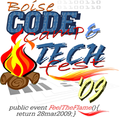

In this economic climate of cut training, cut travel, and general layoffs, it is more important than ever that we keep our technical chops and strong relationships in the development community. That’s good stuff, because:
<blockquote>The 2009 Boise Code Camp and Tech Fest is open for business at <a href="http://boisecodecamp.org/" target="_blank" rel="noopener">BoiseCodeCamp.org</a>.</blockquote>
Sessions are already being registered on the site and we are off to a great start.

This year we are trying something a little different and are hosting 2 sets of sessions throughout the day. In years past it as been apparent there is an appetite for technology sessions that are not necessarily based on code. Typical interests are in Agile development practices, Project Management subjects, Information Technology topics (read networking, virtualization), and anything infrastructure related like IIS, Exchange, and SharePoint.

Yes, Virginia, those people do exist. And, in far greater numbers than those who have the proper usage of  "polymorphism" in their vocabulary. Thus, Tech Fest is born.

Last year’s Boise Code Camp attracted well over 400 people and with the addition of Tech Fest this year we are hoping for upwards of 600 attendees, making this the biggest Code Camp in the Pacific Northwest. We are lucky enough to attract speakers from all over the west and this is now the single biggest technical event in Idaho.

We truly support and welcome first time speakers and there is room for everyone to be involved in some way. Even if you are a short plane ride away from Boise, I encourage you to attend. It will be worth your time and fun will be had by all.

I hope you can attend, present a session, and finagle your employer into throwing us a sponsorship so we can pay for coffee. Of course, the only really required here is your attendance.

I look forward to seeing you there.