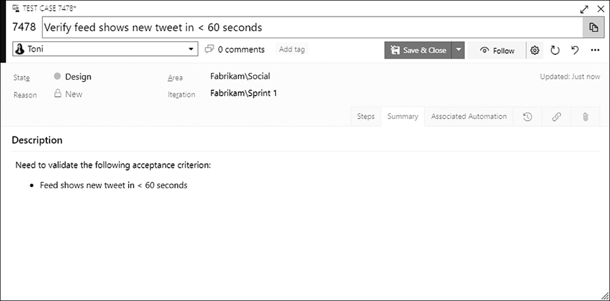

A single PBI with five acceptance criteria can produce five or more Test Case work items. Multiply that across a forecast of eight PBIs and you're staring at 40-some test cases in a Sprint. Without a naming convention, that list becomes a soup of vague titles that nobody can scan. So adopt one. It costs nothing and it pays off the moment your test count climbs.

<strong>The convention I recommend</strong>

The title is required on every Test Case work item, and it should be a short phrase that describes the criteria to test. A convention you could consider is "Verify [criteria]." It reads naturally and forces you to state what passing actually means.

<ul>
  <li>Verify a valid login redirects to the dashboard</li>
  <li>Verify an expired password prompts a reset</li>
  <li>Verify a page request returns a response in 5 seconds or less</li>
</ul>

You may also want to prefix the PBI's ID and/or short title to further identify each test case. So "Verify a valid login redirects to the dashboard" might become "7476 Login: Verify a valid login redirects to the dashboard." A small prefix, a big difference when you're hunting for the right test.

<figure class="wp-block-image size-large has-custom-border"></figure>

<strong>Why the prefix earns its keep</strong>

The payoff shows up when you try to see your tests across the whole Sprint. Azure Test Plans doesn't give you a first-class dashboard across all Requirement-based suites, so teams reach for the "show test points from child suites" setting or a Query-based suite that returns all of the Sprint's test cases. Both of those present test cases in a flat list, and neither follows your original Backlog Priority order. In that flat, alphabetical list, a naming convention is what lets you instantly tell which test case belongs to which PBI.

The same logic applies to regression. When you build a Query-based suite of regression tests, the test cases land in one flat list pulled from many Sprints. A convention that prefixes the PBI name or abbreviation makes them easy to identify at a glance.

Conventions feel like overhead when you have three test cases. They feel like a lifeline when you have ninety. Pick one before you need it.

A little discipline in your titles today, a lot less squinting at lists tomorrow. That's a Preferred Practice worth keeping.

