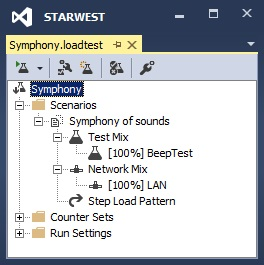
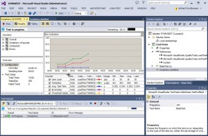

---
title: "A unique load testing experiment"
date: 2014-10-21T16:26:13Z
authors: ["Richard Hundhausen"]
slug: "a-unique-load-testing-experiment"
draft: false
tags: ["Conferences", "Development", "Visual Studio", "Testing"]
---

---

Most of the guidance you'll find about Visual Studio Ultimate Load Tests suggests that they are only for load testing Web Performance tests. Actually, they can be used to load other types of tests, such as unit tests. I demonstrated this at <a href="http://starwest.techwell.com/" target="_blank" rel="noopener">STARWEST </a>last week. Instead of load testing the execution of a database or other service, I thought I would try something fun. I created a simple unit test that played a random tone using the beep command and then placed that under load.

<code><strong>using System;</strong>
<strong> using Microsoft.VisualStudio.TestTools.UnitTesting;</strong>
<strong> namespace Cool.Tests</strong>
<strong> {</strong>
<strong>  </strong>
<strong>  public class Load</strong>
<strong>  {</strong>
<strong>    </strong>
<strong>    public void BeepTest()</strong>
<strong>    {</strong>
<strong>      int frequency = new Random().Next(1000, 5000);</strong>
<strong>      Console.Beep(frequency, 50);</strong>
<strong>    }</strong>
<strong>  }</strong>
<strong> }</strong>
</code>

I then created a simple load test called Symphony.loadtest and added the BeepTest to it.

The resulting load test was fun to listen to. Click the image below to see for yourself.

Attachment: <a href="LoadTestProject.zip">LoadTestProject.zip</a>
