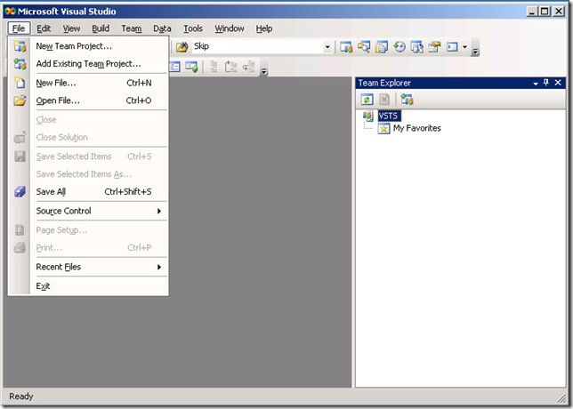
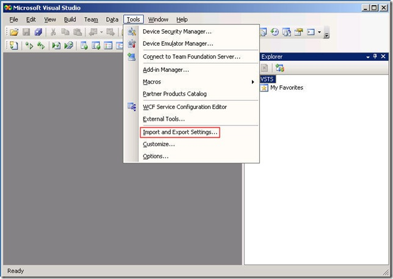
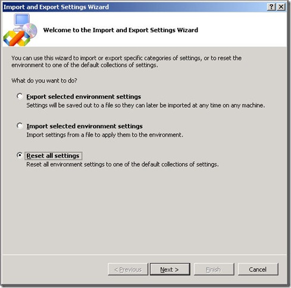
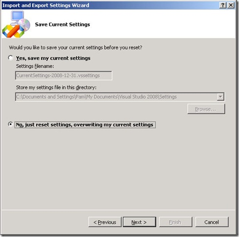
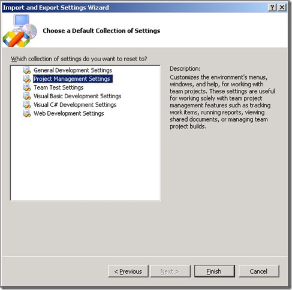

Recently I was working with a client who installed the Team Foundation Client 2008 on his workstation, and subsequently decided to install Visual Studio 2008 Development Edition. The installation completed normally, but when he launched Visual Studio he quickly discovered that some important things were missing.

&nbsp;

For instance, the <strong>File</strong> menu was missing the <strong>New Project</strong> item. It was as if the we were still looking at the Team Foundation Client, and that the installation of the Development Edition had somehow failed. At first this was very puzzling until a sharp developer suggested that we look at the Settings (<strong>Tools</strong> –&gt; <strong>Import and Export Settings</strong>)

&nbsp;

 

 

 

Sure enough, Team Foundation Client had installed and automatically selected the setting called <strong>Project Management</strong>. Although the Development Edition installation added a few more settings, it left the selection unchanged. Once we changed the selection to something more appropriate, all the normal menus became visible. Mystery solved!
