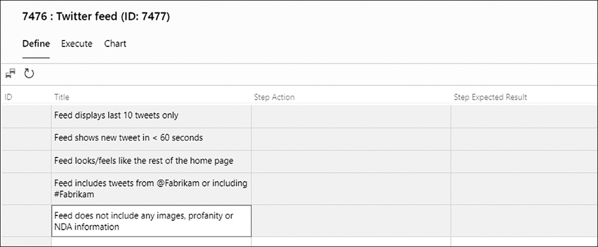

You've written good acceptance criteria for a PBI. Now you want one Test Case work item per criterion so the Developers can swarm, test, and deliver in a more asynchronous way. Typing each one by hand is tedious, and tedious work gets skipped. There's a faster path, and it's hiding in plain sight.

Azure Test Plans has a grid view that lets Developers add or edit test cases in a two-dimensional grid, similar to Microsoft Excel. Combined with copy and paste, it turns a PBI's acceptance criteria into a stack of test cases in seconds.

<strong>The workflow</strong>

<ul>
  <li>Open a PBI work item in the Sprint Backlog.</li>
  <li>Select and copy (Ctrl+C) the acceptance criteria to the clipboard.</li>
  <li>Return to the test plan and choose the option to add new test cases using the grid.</li>
  <li>Paste (Ctrl+V) the copied criteria into the Title column.</li>
  <li>Clean up the titles and save the test cases.</li>
  <li>Repeat for the other PBIs in the Sprint Backlog.</li>
</ul>

<figure class="wp-block-image size-large has-custom-border"></figure>

That's the whole trick. Each line of criteria becomes its own Test Case work item, ready for you to refine.

<strong>Why structure matters</strong>

This approach works best when a PBI's acceptance criteria are enumerated as a list, whether bulleted, numbered, or simply delimited by line breaks. The grid reads each line break as a new row, so a clean list becomes clean test cases. Unstructured criteria, like a paragraph full of rambling sentences, won't paste correctly. You'll end up with a single test case and a cleanup job.

So if the paste produces one row where you expected six, the tool isn't broken. Your criteria are. That's actually useful feedback, and it's worth raising at a Sprint Retrospective.

Knowing ahead of time that your team will generate test cases from acceptance criteria starts to change the way PBIs and criteria are specified. Teams tend to evolve from wordy paragraphs, to simple bullets, and finally to given-when-then expressions with sample data. The grid rewards that discipline.

A few seconds of pasting instead of an hour of typing, and your criteria get cleaner as a side effect. That's a trade I'll take every Sprint.

