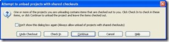

There are two really powerful ways to harvest the output from the build in to Wix.
 
Heat extensions that are native with the Wix Install or John Robbins <a title="Paraffin Description" href="http://www.wintellect.com/CS/blogs/jrobbins/archive/2010/03/10/4107.aspx" target="_blank" rel="noopener">Paraffin</a>. The advantage with using Heat is that with some clients there is a lot of controls with utilising software from the interweb, and Heat is available from the same location as Wix.
 
The Wix installation is available from <a title="Wix on Sourceforge" href="http://wix.sourceforge.net/" target="_blank" rel="noopener">here</a>, remember that you will need v3.5 to use with Visual Studio 2010. (Yes it is still listed as Beta, however it works very well!)
 
Once you have installed Wix and and the project aggregator, the steps to use Heat to harvest the project output are as follows:
 
&nbsp;
 <table style="border-bottom: medium none; border-left: medium none; width: 503.2pt; border-collapse: collapse; border-top: medium none; border-right: medium none; mso-border-alt: solid #7ba0cd 1.0pt; mso-yfti-tbllook: 160; mso-padding-alt: 0cm 5.4pt 0cm 5.4pt; mso-border-insideh: 1.0pt solid #7ba0cd; mso-border-insidev: 1.0pt solid #7ba0cd" class="MsoNormalTable" border="1" cellspacing="0" cellpadding="0" width="671"> <tbody> <tr style="page-break-inside: avoid; mso-yfti-irow: 0; mso-yfti-firstrow: yes"> <td style="border-bottom: #7ba0cd 1pt solid; border-left: #7ba0cd 1pt solid; padding-bottom: 0cm; padding-left: 5.4pt; width: 47.9pt; padding-right: 5.4pt; background: #4f81bd; border-top: #7ba0cd 1pt solid; border-right: #7ba0cd 1pt solid; padding-top: 0cm" valign="top" width="64"> 
<b>Step<?xml:namespace prefix = o /><o:p></o:p></b>
</td> <td style="border-bottom: #7ba0cd 1pt solid; border-left: medium none; padding-bottom: 0cm; padding-left: 5.4pt; width: 455.3pt; padding-right: 5.4pt; background: #4f81bd; border-top: #7ba0cd 1pt solid; border-right: #7ba0cd 1pt solid; padding-top: 0cm; mso-border-left-alt: solid #7ba0cd 1.0pt" valign="top" width="607"> 
<b>Description<o:p></o:p></b>
</td></tr> <tr style="page-break-inside: avoid; mso-yfti-irow: 1"> <td style="border-bottom: #7ba0cd 1pt solid; border-left: #7ba0cd 1pt solid; padding-bottom: 0cm; padding-left: 5.4pt; width: 47.9pt; padding-right: 5.4pt; background: #d3dfee; border-top: medium none; border-right: #7ba0cd 1pt solid; padding-top: 0cm; mso-border-top-alt: solid #7ba0cd 1.0pt" valign="top" width="64"><b> <ol style="margin-top: 0cm" type="1"> <li style="mso-list: l0 level1 lfo1; tab-stops: list 36.0pt" class="MsoNormal"><o:p>&nbsp;</o:p></li></ol></b></td> <td style="border-bottom: #7ba0cd 1pt solid; border-left: medium none; padding-bottom: 0cm; padding-left: 5.4pt; width: 455.3pt; padding-right: 5.4pt; background: #d3dfee; border-top: medium none; border-right: #7ba0cd 1pt solid; padding-top: 0cm; mso-border-left-alt: solid #7ba0cd 1.0pt; mso-border-top-alt: solid #7ba0cd 1.0pt" valign="top" width="607"> 
Create new Wix Project in the solution that you need to build<o:p></o:p>
</td></tr> <tr style="page-break-inside: avoid; mso-yfti-irow: 2"> <td style="border-bottom: #7ba0cd 1pt solid; border-left: #7ba0cd 1pt solid; padding-bottom: 0cm; padding-left: 5.4pt; width: 47.9pt; padding-right: 5.4pt; border-top: medium none; border-right: #7ba0cd 1pt solid; padding-top: 0cm; mso-border-top-alt: solid #7ba0cd 1.0pt" valign="top" width="64"><b> <ol style="margin-top: 0cm" type="1" start="2"> <li style="mso-list: l0 level1 lfo1; tab-stops: list 36.0pt" class="MsoNormal"><o:p>&nbsp;</o:p></li></ol></b></td> <td style="border-bottom: #7ba0cd 1pt solid; border-left: medium none; padding-bottom: 0cm; padding-left: 5.4pt; width: 455.3pt; padding-right: 5.4pt; border-top: medium none; border-right: #7ba0cd 1pt solid; padding-top: 0cm; mso-border-left-alt: solid #7ba0cd 1.0pt; mso-border-top-alt: solid #7ba0cd 1.0pt" valign="top" width="607"> 
Add the references to the projects that you want packaged<o:p></o:p>
</td></tr> <tr style="page-break-inside: avoid; mso-yfti-irow: 3"> <td style="border-bottom: #7ba0cd 1pt solid; border-left: #7ba0cd 1pt solid; padding-bottom: 0cm; padding-left: 5.4pt; width: 47.9pt; padding-right: 5.4pt; background: #d3dfee; border-top: medium none; border-right: #7ba0cd 1pt solid; padding-top: 0cm; mso-border-top-alt: solid #7ba0cd 1.0pt" valign="top" width="64"><b> <ol style="margin-top: 0cm" type="1" start="3"> <li style="mso-list: l0 level1 lfo1; tab-stops: list 36.0pt" class="MsoNormal"><o:p>&nbsp;</o:p></li></ol></b></td> <td style="border-bottom: #7ba0cd 1pt solid; border-left: medium none; padding-bottom: 0cm; padding-left: 5.4pt; width: 455.3pt; padding-right: 5.4pt; background: #d3dfee; border-top: medium none; border-right: #7ba0cd 1pt solid; padding-top: 0cm; mso-border-left-alt: solid #7ba0cd 1.0pt; mso-border-top-alt: solid #7ba0cd 1.0pt" valign="top" width="607"> 
Create a new wxs file called "&lt;myPackage&gt;.wxs"<o:p></o:p>
</td></tr> <tr style="page-break-inside: avoid; mso-yfti-irow: 4"> <td style="border-bottom: #7ba0cd 1pt solid; border-left: #7ba0cd 1pt solid; padding-bottom: 0cm; padding-left: 5.4pt; width: 47.9pt; padding-right: 5.4pt; border-top: medium none; border-right: #7ba0cd 1pt solid; padding-top: 0cm; mso-border-top-alt: solid #7ba0cd 1.0pt" valign="top" width="64"><b> <ol style="margin-top: 0cm" type="1" start="4"> <li style="mso-list: l0 level1 lfo1; tab-stops: list 36.0pt" class="MsoNormal"><o:p>&nbsp;</o:p></li></ol></b></td> <td style="border-bottom: #7ba0cd 1pt solid; border-left: medium none; padding-bottom: 0cm; padding-left: 5.4pt; width: 455.3pt; padding-right: 5.4pt; border-top: medium none; border-right: #7ba0cd 1pt solid; padding-top: 0cm; mso-border-left-alt: solid #7ba0cd 1.0pt; mso-border-top-alt: solid #7ba0cd 1.0pt" valign="top" width="607"> 
Right Click on yourWix Project and select "Unload Project"<o:p></o:p>
</td></tr> <tr style="page-break-inside: avoid; mso-yfti-irow: 5"> <td style="border-bottom: #7ba0cd 1pt solid; border-left: #7ba0cd 1pt solid; padding-bottom: 0cm; padding-left: 5.4pt; width: 47.9pt; padding-right: 5.4pt; background: #d3dfee; border-top: medium none; border-right: #7ba0cd 1pt solid; padding-top: 0cm; mso-border-top-alt: solid #7ba0cd 1.0pt" valign="top" width="64"><b> <ol style="margin-top: 0cm" type="1" start="5"> <li style="mso-list: l0 level1 lfo1; tab-stops: list 36.0pt" class="MsoNormal"><o:p>&nbsp;</o:p></li></ol></b></td> <td style="border-bottom: #7ba0cd 1pt solid; border-left: medium none; padding-bottom: 0cm; padding-left: 5.4pt; width: 455.3pt; padding-right: 5.4pt; background: #d3dfee; border-top: medium none; border-right: #7ba0cd 1
pt solid; padding-top: 0cm; mso-border-left-alt: solid #7ba0cd 1.0pt; mso-border-top-alt: solid #7ba0cd 1.0pt" valign="top" width="607"> 
IN VS2008, at the prompt, click on continue<o:p></o:p>
 
<o:p></o:p>
</td></tr> <tr style="page-break-inside: avoid; mso-yfti-irow: 6"> <td style="border-bottom: #7ba0cd 1pt solid; border-left: #7ba0cd 1pt solid; padding-bottom: 0cm; padding-left: 5.4pt; width: 47.9pt; padding-right: 5.4pt; border-top: medium none; border-right: #7ba0cd 1pt solid; padding-top: 0cm; mso-border-top-alt: solid #7ba0cd 1.0pt" valign="top" width="64"><b> <ol style="margin-top: 0cm" type="1" start="6"> <li style="mso-list: l0 level1 lfo1; tab-stops: list 36.0pt" class="MsoNormal"><o:p>&nbsp;</o:p></li></ol></b></td> <td style="border-bottom: #7ba0cd 1pt solid; border-left: medium none; padding-bottom: 0cm; padding-left: 5.4pt; width: 455.3pt; padding-right: 5.4pt; border-top: medium none; border-right: #7ba0cd 1pt solid; padding-top: 0cm; mso-border-left-alt: solid #7ba0cd 1.0pt; mso-border-top-alt: solid #7ba0cd 1.0pt" valign="top" width="607"> 
Right click on your Wix project and select "Edit yourWixProject.wixproj"<o:p></o:p>
</td></tr> <tr style="page-break-inside: avoid; mso-yfti-irow: 7"> <td style="border-bottom: #7ba0cd 1pt solid; border-left: #7ba0cd 1pt solid; padding-bottom: 0cm; padding-left: 5.4pt; width: 47.9pt; padding-right: 5.4pt; background: #d3dfee; border-top: medium none; border-right: #7ba0cd 1pt solid; padding-top: 0cm; mso-border-top-alt: solid #7ba0cd 1.0pt" valign="top" width="64"><b> <ol style="margin-top: 0cm" type="1" start="7"> <li style="mso-list: l0 level1 lfo1; tab-stops: list 36.0pt" class="MsoNormal"><o:p>&nbsp;</o:p></li></ol></b></td> <td style="border-bottom: #7ba0cd 1pt solid; border-left: medium none; padding-bottom: 0cm; padding-left: 5.4pt; width: 455.3pt; padding-right: 5.4pt; background: #d3dfee; border-top: medium none; border-right: #7ba0cd 1pt solid; padding-top: 0cm; mso-border-left-alt: solid #7ba0cd 1.0pt; mso-border-top-alt: solid #7ba0cd 1.0pt" valign="top" width="607"> 
Ensure that all your project references are included in the project xml<o:p></o:p>
</td></tr> <tr style="page-break-inside: avoid; mso-yfti-irow: 8"> <td style="border-bottom: #7ba0cd 1pt solid; border-left: #7ba0cd 1pt solid; padding-bottom: 0cm; padding-left: 5.4pt; width: 47.9pt; padding-right: 5.4pt; border-top: medium none; border-right: #7ba0cd 1pt solid; padding-top: 0cm; mso-border-top-alt: solid #7ba0cd 1.0pt" valign="top" width="64"><b> <ol style="margin-top: 0cm" type="1" start="8"> <li style="mso-list: l0 level1 lfo1; tab-stops: list 36.0pt" class="MsoNormal"><o:p>&nbsp;</o:p></li></ol></b></td> <td style="border-bottom: #7ba0cd 1pt solid; border-left: medium none; padding-bottom: 0cm; padding-left: 5.4pt; width: 455.3pt; padding-right: 5.4pt; border-top: medium none; border-right: #7ba0cd 1pt solid; padding-top: 0cm; mso-border-left-alt: solid #7ba0cd 1.0pt; mso-border-top-alt: solid #7ba0cd 1.0pt" valign="top" width="607"> 
Scroll to the end of the file<o:p></o:p>
</td></tr> <tr style="page-break-inside: avoid; mso-yfti-irow: 9"> <td style="border-bottom: #7ba0cd 1pt solid; border-left: #7ba0cd 1pt solid; padding-bottom: 0cm; padding-left: 5.4pt; width: 47.9pt; padding-right: 5.4pt; background: #d3dfee; border-top: medium none; border-right: #7ba0cd 1pt solid; padding-top: 0cm; mso-border-top-alt: solid #7ba0cd 1.0pt" valign="top" width="64"><b> <ol style="margin-top: 0cm" type="1" start="9"> <li style="mso-list: l0 level1 lfo1; tab-stops: list 36.0pt" class="MsoNormal"><o:p>&nbsp;</o:p></li></ol></b></td> <td style="border-bottom: #7ba0cd 1pt solid; border-left: medium none; padding-bottom: 0cm; padding-left: 5.4pt; width: 455.3pt; padding-right: 5.4pt; background: #d3dfee; border-top: medium none; border-right: #7ba0cd 1pt solid; padding-top: 0cm; mso-border-left-alt: solid #7ba0cd 1.0pt; mso-border-top-alt: solid #7ba0cd 1.0pt" valign="top" width="607"> 
Add the following snippet<o:p></o:p>
 
&nbsp; &lt;!-- Add the Heat--&gt;<o:p></o:p>
 
&nbsp; &lt;ItemGroup&gt;
 
&nbsp;&nbsp;&nbsp; &lt;HeatProject Include="@(ProjectReference-&gt;'%(FullPath)')"&gt;<o:p></o:p>
 
&nbsp;&nbsp;&nbsp;&nbsp;&nbsp; &lt;ProjectOutputGroups&gt;Binaries;Symbols;Documents;Satellites;Content&lt;/ProjectOutputGroups&gt;<o:p></o:p>
 
&nbsp;&nbs
p;&nbsp; &lt;/HeatProject&gt;<o:p></o:p>
 
&nbsp; &lt;/ItemGroup&gt;<o:p></o:p>
</td></tr> <tr style="page-break-inside: avoid; mso-yfti-irow: 10"> <td style="border-bottom: #7ba0cd 1pt solid; border-left: #7ba0cd 1pt solid; padding-bottom: 0cm; padding-left: 5.4pt; width: 47.9pt; padding-right: 5.4pt; border-top: medium none; border-right: #7ba0cd 1pt solid; padding-top: 0cm; mso-border-top-alt: solid #7ba0cd 1.0pt" valign="top" width="64"><b> <ol style="margin-top: 0cm" type="1" start="10"> <li style="mso-list: l0 level1 lfo1; tab-stops: list 36.0pt" class="MsoNormal"><o:p>&nbsp;</o:p></li></ol></b></td> <td style="border-bottom: #7ba0cd 1pt solid; border-left: medium none; padding-bottom: 0cm; padding-left: 5.4pt; width: 455.3pt; padding-right: 5.4pt; border-top: medium none; border-right: #7ba0cd 1pt solid; padding-top: 0cm; mso-border-left-alt: solid #7ba0cd 1.0pt; mso-border-top-alt: solid #7ba0cd 1.0pt" valign="top" width="607"> 
Save your project<o:p></o:p>
</td></tr> <tr style="page-break-inside: avoid; mso-yfti-irow: 11"> <td style="border-bottom: #7ba0cd 1pt solid; border-left: #7ba0cd 1pt solid; padding-bottom: 0cm; padding-left: 5.4pt; width: 47.9pt; padding-right: 5.4pt; background: #d3dfee; border-top: medium none; border-right: #7ba0cd 1pt solid; padding-top: 0cm; mso-border-top-alt: solid #7ba0cd 1.0pt" valign="top" width="64"><b> <ol style="margin-top: 0cm" type="1" start="11"> <li style="mso-list: l0 level1 lfo1; tab-stops: list 36.0pt" class="MsoNormal"><o:p>&nbsp;</o:p></li></ol></b></td> <td style="border-bottom: #7ba0cd 1pt solid; border-left: medium none; padding-bottom: 0cm; padding-left: 5.4pt; width: 455.3pt; padding-right: 5.4pt; background: #d3dfee; border-top: medium none; border-right: #7ba0cd 1pt solid; padding-top: 0cm; mso-border-left-alt: solid #7ba0cd 1.0pt; mso-border-top-alt: solid #7ba0cd 1.0pt" valign="top" width="607"> 
Right click on your project in solution explorer and select "Reload Project"<o:p></o:p>
</td></tr> <tr style="page-break-inside: avoid; mso-yfti-irow: 12"> <td style="border-bottom: #7ba0cd 1pt solid; border-left: #7ba0cd 1pt solid; padding-bottom: 0cm; padding-left: 5.4pt; width: 47.9pt; padding-right: 5.4pt; border-top: medium none; border-right: #7ba0cd 1pt solid; padding-top: 0cm; mso-border-top-alt: solid #7ba0cd 1.0pt" valign="top" width="64"><b> <ol style="margin-top: 0cm" type="1" start="12"> <li style="mso-list: l0 level1 lfo1; tab-stops: list 36.0pt" class="MsoNormal"><o:p>&nbsp;</o:p></li></ol></b></td> <td style="border-bottom: #7ba0cd 1pt solid; border-left: medium none; padding-bottom: 0cm; padding-left: 5.4pt; width: 455.3pt; padding-right: 5.4pt; border-top: medium none; border-right: #7ba0cd 1pt solid; padding-top: 0cm; mso-border-left-alt: solid #7ba0cd 1.0pt; mso-border-top-alt: solid #7ba0cd 1.0pt" valign="top" width="607"> 
If you still have the project open in the editor, you will be prompted to close it. Click yes and continue<o:p></o:p>
</td></tr> <tr style="page-break-inside: avoid; mso-yfti-irow: 13"> <td style="border-bottom: #7ba0cd 1pt solid; border-left: #7ba0cd 1pt solid; padding-bottom: 0cm; padding-left: 5.4pt; width: 47.9pt; padding-right: 5.4pt; background: #d3dfee; border-top: medium none; border-right: #7ba0cd 1pt solid; padding-top: 0cm; mso-border-top-alt: solid #7ba0cd 1.0pt" valign="top" width="64"><b> <ol style="margin-top: 0cm" type="1" start="13"> <li style="mso-list: l0 level1 lfo1; tab-stops: list 36.0pt" class="MsoNormal"><o:p>&nbsp;</o:p></li></ol></b></td> <td style="border-bottom: #7ba0cd 1pt solid; border-left: medium none; padding-bottom: 0cm; padding-left: 5.4pt; width: 455.3pt; padding-right: 5.4pt; background: #d3dfee; border-top: medium none; border-right: #7ba0cd 1pt solid; padding-top: 0cm; mso-border-left-alt: solid #7ba0cd 1.0pt; mso-border-top-alt: solid #7ba0cd 1.0pt" valign="top" width="607"> 
At this point, your wix project is now heat enabled, but not wired up<o:p></o:p>
</td></tr> <tr style="page-break-inside: avoid; mso-yfti-irow: 14"> <td style="border-bottom: #7ba0cd 1pt solid; border-left: #7ba0cd 1pt solid; padding-bottom: 0cm; padding-left: 5.4pt; width: 47.9pt; padding-right: 5.4pt; border-top: medium none; border-right: #7ba0cd 1pt solid; padding-top: 0cm; mso-border-top-alt: solid #7ba0cd 1.0pt" valign="top" width="64"><b> <ol style="margin-top: 0cm" type="1" start="14"> <li style="mso-list: l0 level1 lfo1; tab-stops: list 36.0pt" class="MsoNormal"><o:p>&nbsp;</o:p></li></ol></b></td> <td style="border-bottom: #7ba0cd 1pt solid; border-left: medium none; padding-bottom: 0cm; padding-left: 5.4pt; width: 455.3pt; padding-right: 5.4pt; border-top: medium none; border-right: #7ba0cd 1pt solid; padding-top: 0cm; mso-border-left-alt: solid #7ba0cd 1.0pt; mso-border-top-alt: solid #7ba0cd 1.0pt" valign="top" width="607"> 
Edit the "&lt;myPackage&gt;.wxs" file<o:p></o:p>
</td></tr> <tr style="page-break-inside: avoid; mso-yfti-irow: 15"> <td style="border-bottom: #7ba0cd 1pt solid; border-left: #7ba0cd 1pt solid; padding-bottom: 0cm; padding-left: 5.4pt; width: 47.9pt; padding-right: 5.4pt; border-top: medium none; border-right: #7ba0cd 1pt solid; padding-top: 0cm; mso-border-top-alt: solid #7ba0cd 1.0pt" valign="top" width="64"><b> <ol style="margin-top: 0cm" type="1" start="15"> <li style="mso-list: l0 level1 lfo1; tab-stops: list 36.0pt" class="MsoNormal"><o:p>&nbsp;</o:p></li></ol></b></td> <td style="border-bottom: #7ba0cd 1pt solid; border-left: medium none; padding-bottom: 0cm; padding-left: 5.4pt; width: 455.3pt; padding-right: 5.4pt; border-top: medium none; border-right: #7ba0cd 1pt solid; padding-top: 0cm; mso-border-left-alt: solid #7ba0cd 1.0pt; mso-border-top-alt: solid #7ba0cd 1.0pt" valign="top" width="607"> 
In the Fragment add a reference for each binaries directory that you want included<o:p></o:p>
 
&lt;DirectoryRef Id="AppRootDir"&gt;<o:p></o:p>
 
&nbsp;&nbsp;&nbsp; &lt;Directory Id="ComponentDir" ComponentGuidGenerationSeed="Insert New GUID Here"&gt;<o:p></o:p>
 
&nbsp;&nbsp;&nbsp;&nbsp;&nbsp;&nbsp;&nbsp;&nbsp;&nbsp;&nbsp;&nbsp; &lt;Directory Id=<b style="mso-bidi-font-weight: normal">'MyReferencedProject</b>.Binaries' /&gt;<o:p></o:p>
 
&nbsp;&nbsp;&nbsp;&nbsp;&nbsp; &lt;/Directory&gt;<o:p></o:p>
 
&lt;/DirectoryRef&gt;<o:p></o:p>
</td></tr> <tr style="page-break-inside: avoid; mso-yfti-irow: 16"> <td style="border-bottom: #7ba0cd 1pt solid; border-left: #7ba0cd 1pt solid; padding-bottom: 0cm; padding-left: 5.4pt; width: 47.9pt; padding-right: 5.4pt; background: #d3dfee; border-top: medium none; border-right: #7ba0cd 1pt solid; padding-top: 0cm; mso-border-top-alt: solid #7ba0cd 1.0pt" valign="top" width="64"><b> <ol style="margin-top: 0cm" type="1" start="16"> <li style="mso-list: l0 level1 lfo1; tab-stops: list 36.0pt" class="MsoNormal"><o:p>&nbsp;</o:p></li></ol></b></td> <td style="border-bottom: #7ba0cd 1pt solid; border-left: medium none; padding-bottom: 0cm; padding-left: 5.4pt; width: 455.3pt; padding-right: 5.4pt; background: #d3dfee; border-top: medium none; border-right: #7ba0cd 1pt solid; padding-top: 0cm; mso-border-left-alt: solid #7ba0cd 1.0pt; mso-border-top-alt: solid #7ba0cd 1.0pt" valign="top" width="607"> 
In the Fragment add a reference for each Symbols directory that you want included<o:p></o:p>
 
&lt;DirectoryRef Id="AppSymbolDir"&gt;<o:p></o:p>
 
&nbsp;&nbsp;&nbsp; &lt;Directory Id="ComponentDir" ComponentGuidGenerationSeed="Insert New GUID Here"&gt;<o:p></o:p>
 
&nbsp;&nbsp;&nbsp;&nbsp;&nbsp;&nbsp;&nbsp;&nbsp;&nbsp;&nbsp;&nbsp; &lt;Directory Id=<b style="mso-bidi-font-weight: normal">'MyReferencedProject</b>.Symbols' /&gt;<o:p></o:p>
 
&nbsp;&nbsp;&nbsp;&nbsp;&nbsp; &lt;/Directory&gt;<o:p></o:p
>
 
&lt;/DirectoryRef&gt;<o:p></o:p>
</td></tr> <tr style="page-break-inside: avoid; mso-yfti-irow: 17"> <td style="border-bottom: #7ba0cd 1pt solid; border-left: #7ba0cd 1pt solid; padding-bottom: 0cm; padding-left: 5.4pt; width: 47.9pt; padding-right: 5.4pt; border-top: medium none; border-right: #7ba0cd 1pt solid; padding-top: 0cm; mso-border-top-alt: solid #7ba0cd 1.0pt" valign="top" width="64"><b> <ol style="margin-top: 0cm" type="1" start="17"> <li style="mso-list: l0 level1 lfo1; tab-stops: list 36.0pt" class="MsoNormal"><o:p>&nbsp;</o:p></li></ol></b></td> <td style="border-bottom: #7ba0cd 1pt solid; border-left: medium none; padding-bottom: 0cm; padding-left: 5.4pt; width: 455.3pt; padding-right: 5.4pt; border-top: medium none; border-right: #7ba0cd 1pt solid; padding-top: 0cm; mso-border-left-alt: solid #7ba0cd 1.0pt; mso-border-top-alt: solid #7ba0cd 1.0pt" valign="top" width="607"> 
For the other Project Outputs (Documents;Satellites;Content), the principal is the same, the DirectoryRef is the "appRootDir"<o:p></o:p>
</td></tr> <tr style="page-break-inside: avoid; mso-yfti-irow: 18"> <td style="border-bottom: #7ba0cd 1pt solid; border-left: #7ba0cd 1pt solid; padding-bottom: 0cm; padding-left: 5.4pt; width: 47.9pt; padding-right: 5.4pt; background: #d3dfee; border-top: medium none; border-right: #7ba0cd 1pt solid; padding-top: 0cm; mso-border-top-alt: solid #7ba0cd 1.0pt" valign="top" width="64"><b> <ol style="margin-top: 0cm" type="1" start="18"> <li style="mso-list: l0 level1 lfo1; tab-stops: list 36.0pt" class="MsoNormal"><o:p>&nbsp;</o:p></li></ol></b></td> <td style="border-bottom: #7ba0cd 1pt solid; border-left: medium none; padding-bottom: 0cm; padding-left: 5.4pt; width: 455.3pt; padding-right: 5.4pt; background: #d3dfee; border-top: medium none; border-right: #7ba0cd 1pt solid; padding-top: 0cm; mso-border-left-alt: solid #7ba0cd 1.0pt; mso-border-top-alt: solid #7ba0cd 1.0pt" valign="top" width="607"> 
For each item that is to be included in the package, a component Group and Component Group Ref needs to be added at the bottom of the file<o:p></o:p>
 
&nbsp; &lt;ComponentGroup Id="Project"&gt;<o:p></o:p>
 
&nbsp;&nbsp;&nbsp;&nbsp;&nbsp; &lt;ComponentGroupRef Id=<b style="mso-bidi-font-weight: normal">'MyReferencedProject</b>.Binaries' /&gt;<o:p></o:p>
 
&nbsp;&nbsp;&nbsp;&nbsp;&nbsp; &lt;ComponentGroupRef Id=<b style="mso-bidi-font-weight: normal">'MyReferencedProject</b>.Symbols' /&gt;<o:p></o:p>
 
&nbsp; &lt;/ComponentGroup&gt;<o:p></o:p>
</td></tr> <tr style="page-break-inside: avoid; mso-yfti-irow: 19"> <td style="border-bottom: #7ba0cd 1pt solid; border-left: #7ba0cd 1pt solid; padding-bottom: 0cm; padding-left: 5.4pt; width: 47.9pt; padding-right: 5.4pt; border-top: medium none; border-right: #7ba0cd 1pt solid; padding-top: 0cm; mso-border-top-alt: solid #7ba0cd 1.0pt" valign="top" width="64"><b> <ol style="margin-top: 0cm" type="1" start="19"> <li style="mso-list: l0 level1 lfo1; tab-stops: list 36.0pt" class="MsoNormal"><o:p>&nbsp;</o:p></li></ol></b></td> <td style="border-bottom: #7ba0cd 1pt solid; border-left: medium none; padding-bottom: 0cm; padding-left: 5.4pt; width: 455.3pt; padding-right: 5.4pt; border-top: medium none; border-right: #7ba0cd 1pt solid; padding-top: 0cm; mso-border-left-alt: solid #7ba0cd 1.0pt; mso-border-top-alt: solid #7ba0cd 1.0pt" valign="top" width="607"> 
Run the full solution build, and an MSI should appear<o:p></o:p>
</td></tr> <tr style="page-break-inside: avoid; mso-yfti-irow: 20; mso-yfti-lastrow: yes"> <td style="border-bottom: #7ba0cd 1pt solid; border-left: #7ba0cd 1pt solid; padding-bottom: 0cm; padding-left: 5.4pt; width: 47.9pt; padding-right: 5.4pt; background: #d3dfee; border-top: medium none; border-right: #7ba0cd 1pt solid; padding-top: 0cm; mso-border-top-alt: solid #7ba0cd 1.0pt" valign="top" width="64"><b> <ol style="margin-top: 0cm" type="1" start="20"> <li style="mso-list: l0 level1 lfo1; tab-stops: list 36.0pt" class="MsoNormal"><o:p>&nbsp;</o:p></li></ol></b></td> <td style="border-bottom: #7ba0cd 1pt solid; border-left: medium none; padding-bottom: 0cm; padding-left: 5.4pt; width: 455.3pt; padding-right: 5.4pt; background: #d3dfee; border-top: medium none; border-right: #7ba0cd 1pt solid; padding-top: 0cm; mso-border-left-alt: solid #7ba0cd 1.0pt; mso-border-top-alt: solid #7ba0cd 1.0pt" valign="top" width="607"> 
Use Insted or Orca to check that the correct components are included in the MSI
</td></tr></tbody></table> 
&nbsp;
 
So the project.wxs looks like
 
&lt;?xml version="1.0" encoding="UTF-8"?&gt; &lt;Wix xmlns="<a href="http://schemas.microsoft.com/wix/2006/wi&quot;">http://schemas.microsoft.com/wix/2006/wi"</a>&gt; &nbsp; &lt;Product Id="*" Name="SetupDemo" Language="1033" Version="1.0.0.0" Manufacturer="SetupDemo" UpgradeCode="78282ed7-9280-497b-affa-da3fce3f4f47"&gt; &nbsp;&nbsp;&nbsp; &lt;Package InstallerVersion="200" Compressed="yes" Id ="*" /&gt;  
&nbsp;&nbsp;&nbsp; &lt;Media Id="1" Cabinet="Demo1.cab" EmbedCab="yes" /&gt;  
&nbsp;&nbsp;&nbsp; &lt;Directory Id="TARGETDIR" Name="SourceDir"&gt; &nbsp;&nbsp;&nbsp;&nbsp;&nbsp; &lt;Directory Id="ProgramFilesFolder"&gt; &nbsp;&nbsp;&nbsp;&nbsp;&nbsp;&nbsp;&nbsp; &lt;Directory Id="INSTALLLOCATION" Name="SetupDemo"&gt; &nbsp;&nbsp;&nbsp;&nbsp;&nbsp;&nbsp;&nbsp;&nbsp;&nbsp; &lt;Directory Id="AppRootDir" Name="Demo"/&gt; &nbsp;&nbsp;&nbsp;&nbsp;&nbsp;&nbsp;&nbsp;&nbsp;&nbsp; &lt;Directory Id="AppSymbolDir" Name="Demo" /&gt;  
&nbsp;&nbsp;&nbsp;&nbsp;&nbsp;&nbsp;&nbsp; &lt;/Directory&gt; &nbsp;&nbsp;&nbsp;&nbsp;&nbsp; &lt;/Directory&gt; &nbsp;&nbsp;&nbsp; &lt;/Directory&gt;  
&nbsp;&nbsp;&nbsp; &lt;Feature Id="ProductFeature" Title="SetupDemo" Level="1"&gt; &nbsp;&nbsp;&nbsp;&nbsp;&nbsp;&nbsp; &lt;ComponentGroupRef Id="Project" /&gt;  
&nbsp;&nbsp;&nbsp;&nbsp;&nbsp; &lt;!-- Note: The following ComponentGroupRef is required to pull in generated authoring from project references. --&gt; &nbsp;&nbsp;&nbsp;&nbsp;&nbsp; &lt;ComponentGroupRef Id="Product.Generated" /&gt; &nbsp;&nbsp;&nbsp; &lt;/Feature&gt; &nbsp; &lt;/Product&gt; &lt;/Wix&gt;  
&nbsp; 
And the associated (Demo.wxs) looks like  
&lt;?xml version="1.0" encoding="UTF-8"?&gt; &lt;Wix xmlns="<a href="http://schemas.microsoft.com/wix/2006/wi&quot;">http://schemas.microsoft.com/wix/2006/wi"</a>&gt; &nbsp;&nbsp;&nbsp; &lt;Fragment&gt; &nbsp;&nbsp;&nbsp; &lt;DirectoryRef Id="AppRootDir"&gt; &nbsp;&nbsp;&nbsp;&nbsp;&nbsp; &lt;Directory Id="ComponentDir" ComponentGuidGenerationSeed="DBA8384E-CE1B-41af-B573-4203FB8A6A3B"&gt; &nbsp;&nbsp;&nbsp;&nbsp;&nbsp;&nbsp;&nbsp; &lt;Directory Id="Demo.Binaries" /&gt; &nbsp;&nbsp;&nbsp;&nbsp;&nbsp; &lt;/Directory&gt; &nbsp;&nbsp;&nbsp; &lt;/DirectoryRef&gt; &nbsp;&nbsp;&nbsp; &lt;DirectoryRef Id="AppSymbolDir"&gt; &nbsp;&nbsp;&nbsp;&nbsp;&nbsp; &lt;Directory Id="SymbolsDir" ComponentGuidGenerationSeed="35A3DCB8-4F85-4e3f-AC83-C51B78C04B94"&gt; &nbsp;&nbsp;&nbsp;&nbsp;&nbsp;&nbsp;&nbsp; &lt;Directory Id="Demo.Symbols" /&gt; &nbsp;&nbsp;&nbsp;&nbsp;&nbsp; &lt;/Directory&gt; &nbsp;&nbsp;&nbsp; &lt;/DirectoryRef&gt; &nbsp;&nbsp;&nbsp; &lt;ComponentGroup Id="Project"&gt; &nbsp;&nbsp;&nbsp;&nbsp;&nbsp; &lt;ComponentGroupRef Id="Demo.Binaries"/&gt; &nbsp;&nbsp;&nbsp;&nbsp;&nbsp; &lt;ComponentGroupRef Id="Demo.Symbols"/&gt; &nbsp;&nbsp;&nbsp; &lt;/ComponentGroup&gt; &nbsp;&nbsp;&nbsp; &lt;/Fragment&gt; &lt;/Wix&gt;  
&nbsp;
 <table style="border-bottom: medium none; border-left: medium none; border-collapse: collapse; border-top: medium none; border-right: medium none; mso-border-alt: solid #7ba0cd 1.0pt; mso-yfti-tbllook: 1184; mso-padding-alt: 0cm 5.4pt 0cm 5.4pt; mso-border-insidev: 1.0pt solid #7ba0cd; mso-table-layout-alt: fixed; mso-border-themecolor: accent1; mso-border-themetint: 191; mso-border-insidev-themecolor: accent1; mso-border-insidev-themetint: 191" class="MsoTableMediumShading1Accent1" border="1" cellspacing="0" cellpadding="0" width="669"> <tbody> <tr style="mso-yfti-irow: -1; mso-yfti-firstrow: yes"> <td style="border-bottom: #7ba0cd 1pt solid; border-left: #7ba0cd 1pt solid; padding-bottom: 0cm; padding-left: 5.4pt; width: 196.8pt; padding-right: 5.4pt; background: #4f81bd; border-top: #7ba0cd 1pt solid; border-right: medium none; padding-top: 0cm; mso-border-themecolor: accent1; mso-border-themetint: 191; mso-background-themecolor: accent1" valign="top" width="262"> 
<b>Tool<o:p></o:p></b>
</td> <td style="border-bottom: #7ba0cd 1pt solid; border-left: medium none; padding-bottom: 0cm; padding-left: 5.4pt; width: 304.75pt; padding-right: 5.4pt; background: #4f81bd; border-top: #7ba0cd 1pt solid; border-right: #7ba0cd 1pt solid; padding-top: 0cm; mso-border-themecolor: accent1; mso-border-themetint: 191; mso-background-themecolor: accent1" valign="top" width="406"> 
<b>Link<o:p></o:p></b>
</td></tr> <tr style="mso-yfti-irow: 0"> <td style="border-bottom: #7ba0cd 1pt solid; border-left: #7ba0cd 1pt solid; padding-bottom: 0cm; padding-left: 5.4pt; width: 196.8pt; padding-right: 5.4pt; background: #d3dfee; border-top: medium none; border-right: medium none; padding-top: 0cm; mso-border-top-alt: solid #7ba0cd 1.0pt; mso-background-themecolor: accent1; mso-border-left-themecolor: accent1; mso-border-left-themetint: 191; mso-border-bottom-themecolor: accent1; mso-border-bottom-themetint: 191; mso-border-top-themecolor: accent1; mso-border-top-themetint: 191; mso-background-themetint: 63" valign="top" width="262"> 
<b>Orca is available from here<o:p></o:p></b>
</td> <td style="border-bottom: #7ba0cd 1pt solid; border-left: medium none; padding-bottom: 0cm; padding-left: 5.4pt; width: 304.75pt; padding-right: 5.4pt; background: #d3dfee; border-top: medium none; border-right: #7ba0cd 1pt solid; padding-top: 0cm; mso-border-top-alt: solid #7ba0cd 1.0pt; mso-background-themecolor: accent1; mso-border-bottom-themecolor: accent1; mso-border-bottom-themetint: 191; mso-border-top-themecolor: accent1; mso-border-top-themetint: 191; mso-background-themetint: 63; mso-border-right-themecolor: accent1; mso-border-right-themetint: 191" valign="top" width="406"> 
<a title="http://support.microsoft.com/kb/255905" href="http://support.microsoft.com/kb/255905">http://support.microsoft.com/kb/255905</a><o:p></o:p>
</td></tr> <tr style="mso-yfti-irow: 1"> <td style="border-bottom: #7ba0cd 1pt solid; border-left: #7ba0cd 1pt solid; padding-bottom: 0cm; padding-left: 5.4pt; width: 196.8pt; padding-right: 5.4pt; border-top: medium none; border-right: #7ba0cd 1pt solid; padding-top: 0cm; mso-border-top-alt: solid #7ba0cd 1.0pt; mso-border-themecolor: accent1; mso-border-themetint: 191; mso-border-top-themecolor: accent1; mso-border-top-themetint: 191" valign="top" width="262"> 
<b>InstEd is available from here<o:p></o:p></b>
</td> <td style="border-bottom: #7ba0cd 1pt solid; border-left: medium none; padding-bottom: 0cm; padding-left: 5.4pt; width: 304.75pt; padding-right: 5.4pt; border-top: medium none; border-ri
ght: #7ba0cd 1pt solid; padding-top: 0cm; mso-border-left-alt: solid #7ba0cd 1.0pt; mso-border-top-alt: solid #7ba0cd 1.0pt; mso-border-left-themecolor: accent1; mso-border-left-themetint: 191; mso-border-bottom-themecolor: accent1; mso-border-bottom-themetint: 191; mso-border-top-themecolor: accent1; mso-border-top-themetint: 191; mso-border-right-themecolor: accent1; mso-border-right-themetint: 191" valign="top" width="406"> 
<a title="http://www.instedit.com/home.html" href="http://www.instedit.com/home.html">http://www.instedit.com/home.html</a><o:p></o:p>
</td></tr> <tr style="mso-yfti-irow: 2"> <td style="border-bottom: #7ba0cd 1pt solid; border-left: #7ba0cd 1pt solid; padding-bottom: 0cm; padding-left: 5.4pt; width: 196.8pt; padding-right: 5.4pt; background: #d3dfee; border-top: medium none; border-right: medium none; padding-top: 0cm; mso-border-top-alt: solid #7ba0cd 1.0pt; mso-background-themecolor: accent1; mso-border-left-themecolor: accent1; mso-border-left-themetint: 191; mso-border-bottom-themecolor: accent1; mso-border-bottom-themetint: 191; mso-border-top-themecolor: accent1; mso-border-top-themetint: 191; mso-background-themetint: 63" valign="top" width="262"> 
<b>Wix installer is available from here<o:p></o:p></b>
</td> <td style="border-bottom: #7ba0cd 1pt solid; border-left: medium none; padding-bottom: 0cm; padding-left: 5.4pt; width: 304.75pt; padding-right: 5.4pt; background: #d3dfee; border-top: medium none; border-right: #7ba0cd 1pt solid; padding-top: 0cm; mso-border-top-alt: solid #7ba0cd 1.0pt; mso-background-themecolor: accent1; mso-border-bottom-themecolor: accent1; mso-border-bottom-themetint: 191; mso-border-top-themecolor: accent1; mso-border-top-themetint: 191; mso-background-themetint: 63; mso-border-right-themecolor: accent1; mso-border-right-themetint: 191" valign="top" width="406"> 
<a title="http://wix.sourceforge.net/" href="http://wix.sourceforge.net/">http://wix.sourceforge.net/</a><o:p></o:p>
</td></tr> <tr style="mso-yfti-irow: 3; mso-yfti-lastrow: yes"> <td style="border-bottom: #7ba0cd 1pt solid; border-left: #7ba0cd 1pt solid; padding-bottom: 0cm; padding-left: 5.4pt; width: 196.8pt; padding-right: 5.4pt; border-top: medium none; border-right: #7ba0cd 1pt solid; padding-top: 0cm; mso-border-top-alt: solid #7ba0cd 1.0pt; mso-border-themecolor: accent1; mso-border-themetint: 191; mso-border-top-themecolor: accent1; mso-border-top-themetint: 191" valign="top" width="262"> 
<b>Paraffin is available from here<o:p></o:p></b>
</td> <td style="border-bottom: #7ba0cd 1pt solid; border-left: medium none; padding-bottom: 0cm; padding-left: 5.4pt; width: 304.75pt; padding-right: 5.4pt; border-top: medium none; border-right: #7ba0cd 1pt solid; padding-top: 0cm; mso-border-left-alt: solid #7ba0cd 1.0pt; mso-border-top-alt: solid #7ba0cd 1.0pt; mso-border-left-themecolor: accent1; mso-border-left-themetint: 191; mso-border-bottom-themecolor: accent1; mso-border-bottom-themetint: 191; mso-border-top-themecolor: accent1; mso-border-top-themetint: 191; mso-border-right-themecolor: accent1; mso-border-right-themetint: 191" valign="top" width="406"> 
<a title="http://www.wintellect.com/CS/files/folders/8198/download.aspx" href="http://www.wintellect.com/CS/files/folders/8198/download.aspx">http://www.wintellect.com/CS/files/folders/8198/download.aspx</a><o:p></o:p>
</td></tr></tbody></table>