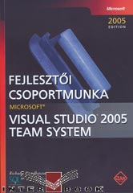

I just ran across my Visual Studio 2005 Team System book in Hungarian. Very cool!

 Check out the <a href="http://www.interbook.hu/uj/index.php?op=termek_reszletes&amp;termek_id=8244&amp;fokat=1" target="none" rel="noopener">Interbook.hu site</a> for more information. I'll see if I can't get a copy.
