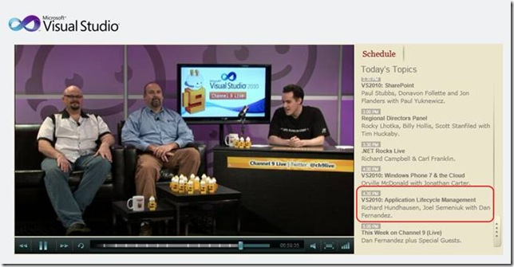

At the Visual Studio 2010 launch a few weeks ago I was interviewed, along with <a href="http://www.pluralsight-training.net/microsoft/instructor.aspx?name=david-starr" target="_blank" rel="noopener">David Starr</a>, about ALM. I just found the recording online.
 
Here are the steps to get to it:
 
1. Go to <a title="http://channel9.msdn.com/vs2010_ch9live_ondemand.htm" href="http://channel9.msdn.com/vs2010_ch9live_ondemand.htm" target="_blank" rel="noopener">http://channel9.msdn.com/vs2010_ch9live_ondemand.htm</a> 
2. Drag the selector bar ahead to about the 7 hour mark. 
&nbsp; 

