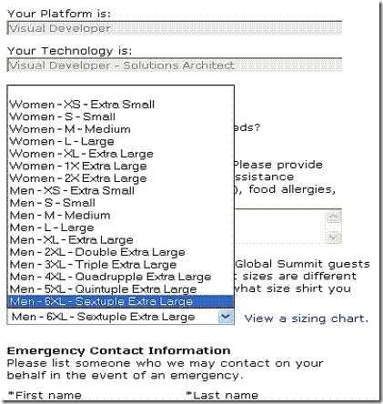
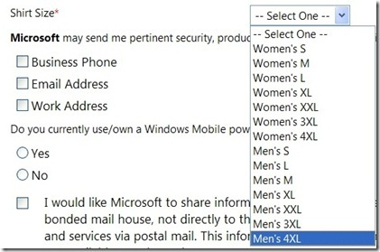

We all know the sedentary lifestyle of your classic IT person can lead to ... shall we say ... bloat. I regularly joke that the only thing bigger than your typical (Unix) system administrator is his beard. I jest. 
 
Anyway, we do what we can to avoid the bloat, including running (literally) some form of carbon-based defrag on a regular basis, to compact that extra space.
 
... and it may be working across the industry.
 
Here's my evidence.
 
When registering for a Microsoft developer event in 2005, notice the shirt sizes go to 6XL ...
 
 
 
But, for this year's Tech-Ed Developer conference, only 4XL ...
 
 
 
I'm going to assume that Microsoft has leveraged the cool data-mining features in SQL Server to determine that 5XL and 6XL sizes are vanishing.
