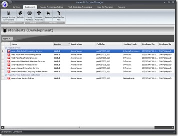

Last week I had a chance to meet some of the brains behind <a href="http://www.gridgistics.net" target="_blank" rel="noopener">gridGISTICS</a> - a .NET development company in Atlanta that gets it. Not only are they up to speed on the latest .NET 3.x technologies, but they have some killer products as well.
 
The one that struck me as the coolest was their <a href="http://www.gridgistics.net/main_product.aspx" target="_blank" rel="noopener">Aware Server</a> product, which is a grid-computing based deployment and management environment. In other words, the missing pieces to Team Foundation Server's build and (ahem) deploy automation. Packaging up applications by system and version into manifests, these binaries can be automatically deployed, registered, launched, and monitored by various Aware Agents installed around a company's environment. From the development side, they provide many Visual Studio 2008 templates and add-ins to help generate Aware-compatible applications very quickly.
 
 
 
Follow their story <a href="http://blog.gridgistics.net/" target="_blank" rel="noopener">here</a>.
