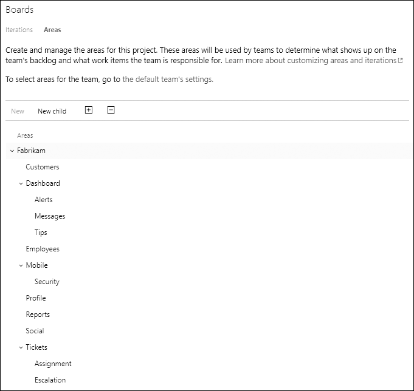
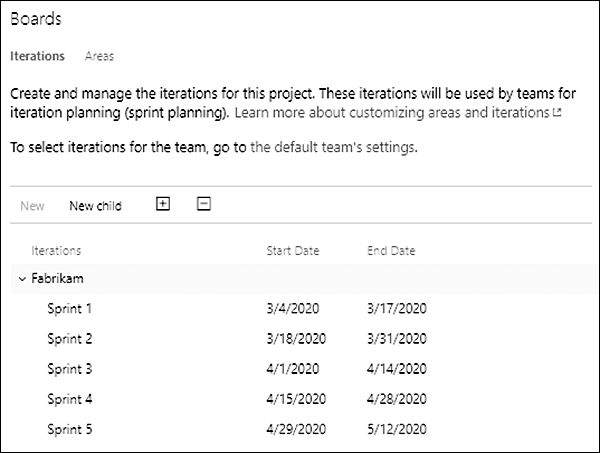

Two of the most useful organizing concepts in Azure Boards get confused all the time, and the confusion creates real mess in a backlog. Area paths and iteration paths sound similar and live near each other in project configuration, but they answer two completely different questions. Area paths answer "what part of the product, and whose?" Iteration paths answer "when?" Tangle them and you'll spend Sprints untangling.

<strong>Area paths model space</strong>

Area paths reflect the logical or functional areas of the product. You build a hierarchy that mirrors how the product is actually structured, and you can nest sub-areas beneath parent areas to whatever depth makes sense. A team's selected areas determine which work items show up on that team's backlog, and a team can designate one of its areas as the default, which gets suggested when creating new work items.

<figure class="wp-block-image size-large has-custom-border"></figure>

That last point is the one that makes area paths more than just a tagging scheme. They model team ownership. The areas a team selects are the slice of the product that team looks after, and the backlog filters accordingly. On a single-team project the default team uses the root area and sees everything. The moment you add teams, areas become how you carve the product up and assign responsibility. One tip: if there's any chance you'll add child areas later, include sub-areas when selecting them, or new work items in those children won't appear on your backlog.

<strong>Iteration paths model time</strong>

Iteration paths are about time. For Scrum Teams, they let PBI, Task, Test Case, and other work items be grouped by Sprint. You define Sprints with their start and end dates at the project level, and then each team selects the ones it wants active. The iterations a team selects appear in the Planning pane on the Backlogs page and on the Sprints page for the Sprint Backlog and Taskboard.

<figure class="wp-block-image size-large has-custom-border"></figure>

Keep the list of selected iterations small. A team usually only needs the current Sprint and a few future ones to support its planning horizon. There's no value in staring at thirty Sprints when you forecast two at a time.

<strong>Don't tangle them</strong>

The mistake I see is teams trying to make one concept do the other's job, like baking a release or a phase into an area name, or using iterations to represent components. Don't. Let area paths describe the product and who owns each part of it. Let iteration paths describe the calendar of Sprints. One models the product, the other models the schedule, and when each stays in its lane, your backlog filters cleanly and your <a href="https://scrumguides.org/" target="_blank" rel="noopener">Scrum</a> tooling does what you expect.

Areas are where. Iterations are when. Keep them separate and Azure Boards stays out of your way. Sounds like good Scrum to me.

