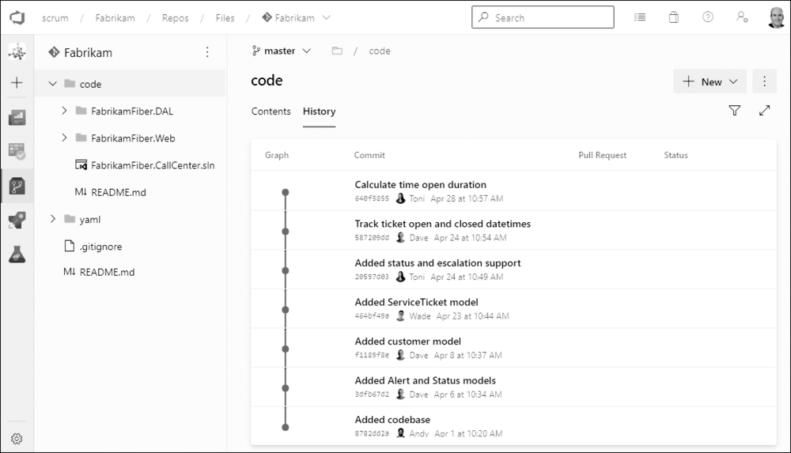

It's a smell when I don't see commits associated with a work item. It usually means the Developers decided that traceability isn't worth the extra step. It is. Linking a Git commit to the work item it implements is a tiny habit that buys you bidirectional, end-to-end traceability from plan to release, and it's one of the highest-return things a Scrum Team can do with Azure DevOps.

<strong>Why it matters</strong>

Picture a Developer working on a forecasted PBI in the Sprint Backlog, with the plan represented as Task or Test Case work items. When they commit, they should associate that commit with the work item they're working on. Why? Because if a Scrum Team uses the planning tools in Azure Boards the way I recommend, the Epic, Feature, PBI, and Task work items are already linked automatically. On the engineering side, commits are associated with builds, and builds with releases, automatically by Azure Repos and Azure Pipelines. So the chain from ideas to plans to builds to releases is nearly complete on its own.

Nearly. There is exactly one critical link that Azure DevOps cannot make for you: the association between a Git commit and the relevant Task or Test Case work item. That single manual step bridges work planning with work execution. Make it, and you have unbroken, bidirectional traceability from a high-level idea all the way down to the line of code and back up to the release that shipped it. Skip it, and the chain breaks right at the most interesting point.

<figure class="wp-block-image size-large has-custom-border"></figure>

<strong>The habit to build</strong>

The mechanism is almost embarrassingly simple. To associate a commit, just include the work item ID in the commit comment. If you're working on Task #42, your comment might read "Added email validation #42" or "#42 Added email validation." When you push to Azure Repos, Azure DevOps creates a Commit type link between the commit and work item #42, visible on the work item form and in the commit details. You may need to enable automatic creation of work item links in project settings, since that option is sometimes disabled.

If you'd rather not memorize IDs, Visual Studio Team Explorer lets you associate work items to commits by dragging from a query. And if a Developer forgets entirely, you can associate a commit to a work item after the fact in Azure Boards by editing the work item and adding a Commit type link. There's really no excuse, which is why a missing link is a smell.

<strong>Make it routine</strong>

The trick is to make this a reflex, not a chore the team debates each Sprint. Pair the work item ID with a meaningful commit comment and you've added two small pieces of metadata that, together, explain later exactly why a change was made. The best Scrum Teams treat this as part of what it means to commit, the same way they treat writing a useful comment.

One ID in one commit message. That's the whole habit, and it ties your entire <a href="https://scrumguides.org/" target="_blank" rel="noopener">Scrum</a> plan to your shipped code. Sounds like good Scrum to me.

