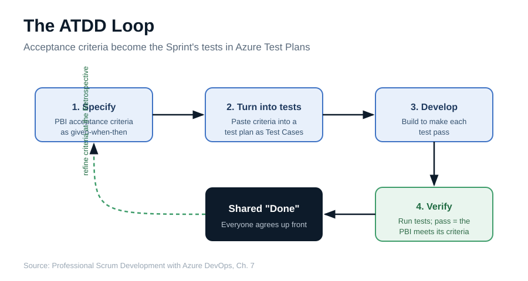
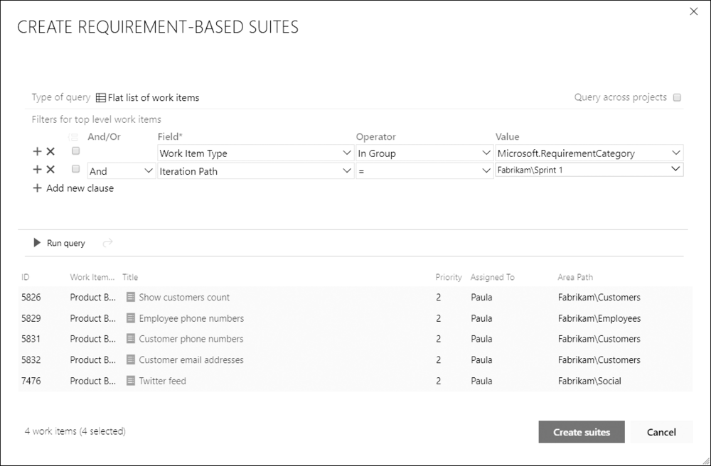

Starting work by creating failing tests can feel counterintuitive and weird. It also works. Test-driven development proves that every day. Acceptance test-driven development, or ATDD, takes the same idea up a level: instead of driving the design of the code, it drives the team's shared understanding of what they're building and what Done looks like at each step.

That shared understanding is the whole point. ATDD encourages the Developers to discuss the acceptance criteria collaboratively with the right people. Those conversations yield practical examples from the user's viewpoint, and those examples become the basis for the acceptance tests. All of it can happen before any application coding begins.

<figure class="wp-block-image size-large has-custom-border"></figure>

<strong>The loop, step by step</strong>

Here's how it plays out concretely on a Scrum Team using Azure Test Plans.

<ul>
  <li>Collaboratively discuss the PBI's acceptance criteria with the Product Owner and stakeholders, drawing out examples from the user's perspective.</li>
  <li>Turn those criteria into Test Case work items, organized in Requirement-based suites so each suite maps to a single PBI.</li>
  <li>Develop against the failing tests, iterating through each PBI, developing and testing until that PBI is Done.</li>
  <li>Verify. As development progresses, more and more acceptance tests start passing. When the last test passes and the Definition of Done is met, you're finished with that PBI.</li>
</ul>

A Requirement-based suite maps to a specific PBI work item and holds the acceptance tests for just that PBI. The work item ID and title form the suite's name, such as "7476 : Twitter feed," and as test cases are added they're automatically linked back to the PBI. Even better, you can create Requirement-based suites for every forecasted PBI in one step.

<figure class="wp-block-image size-large has-custom-border"></figure>

Don't settle for one test case per PBI. Plan on a separate Test Case work item for each acceptance criterion. If the Definition of Done includes happy and unhappy path tests, a moderately complex PBI could carry a dozen or more acceptance tests, all failing until that facet of the PBI is properly coded.

ATDD pays off in other ways too. For distributed teams, tests written in natural language give dislocated Developers the clarity to focus on making them pass. And for anyone who struggles to self-manage, "make our tests pass" is a simple, concrete goal that brings focus to the day.

Specify, turn into tests, develop, verify. Run that loop every Sprint and your team always knows what Done looks like. Sounds like good <a href="https://scrumguides.org/" target="_blank" rel="noopener">Scrum</a> to me.

