
I'm a fan of Mural and a super fan of Azure DevOps. Turns out they work pretty well together. Using Mural as a front-end to Azure DevOps offers an alternative approach to planning, visualizing, and managing work with creativity and flexibility. Mural's visual collaboration platform transforms the traditional, linear task management experience found in Azure DevOps into an interactive, digital workspace. Teams can easily create visual roadmaps, story maps, and Sprint plans, as well as collect freeform feedback during Sprint Reviews and Sprint Retrospectives.

Specifically, the integration allows me to:

<ul>
<li>Connect to Azure DevOps organization(s)</li>

<li>Use filters to find work items to import</li>

<li>Use a work item query to find work items</li>

<li>Import work items as sticky notes on the canvas</li>

<li>Create new work items from sticky notes</li>
</ul>

<strong>Starting with a Product Backlog</strong>

Using a modified <a href="https://learn.microsoft.com/en-us/azure/devops/boards/work-items/guidance/scrum-process-workflow" title="Scrum process">Scrum process</a> (to better match the <a href="https://scrumguides.org/" title="Scrum Guide">Scrum Guide</a>), I have added fifty items to the Product Backlog. Ok, I didn't actually add them, my PowerShell script did. It generated a random Title, Effort (using a Fibonacci scale of 1, 2, 3, 5, 13, or 21), and Business Value (using a similar scale but x100 to make them look a little more "valuey". Also, my custom Scrum process introduces an ROI field which is just Value / Effort.

<figure class="wp-block-image size-full has-custom-border">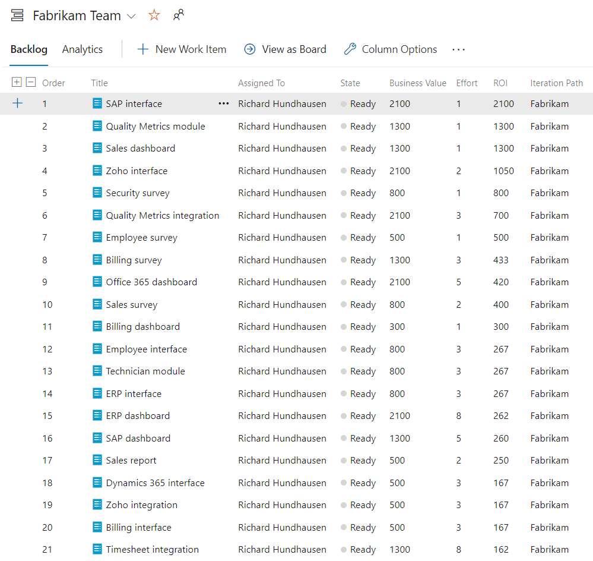</figure>

<strong>Creating a custom shared query</strong>

Rather than import the entire Product Backlog into Mural, I've created a shared work item query that selects only the "High ROI" (ROI &gt; 100) Product Backlog items. By using this query, I'll be importing only 25 work items into Mural. If you want to visualize work across Azure DevOps projects, Mural supports cross-project queries.

<figure class="wp-block-image size-large has-custom-border">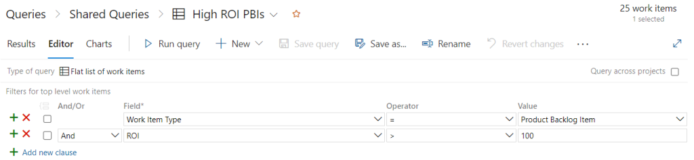</figure>

<strong>Connecting Mural to Azure DevOps</strong>

Since I am already a Mural customer, I can go straight to <em>Integrations </em>and simply select Azure DevOps.

<figure class="wp-block-image size-large has-custom-border">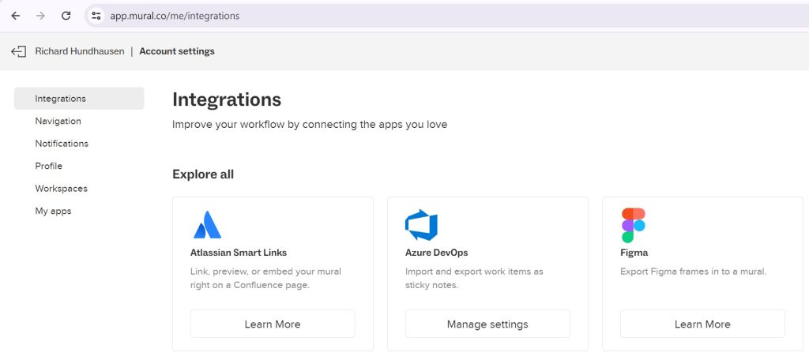</figure>

I need to grant permission to Mural for it to securely communicate with Azure DevOps. I'll specify my Azure DevOps organization and then accept the request for permissions (to read/write work items, read project &amp; team, and read user information). Mural allows me to connect to multiple Azure DevOps organizations.

<figure class="wp-block-image size-full is-resized has-custom-border"></figure>

<strong>Creating a new Mural</strong>

By default, when I create a new Mural, I'm prompted for a template. Normally I dismiss this, but today I'll select the <em>Now, next, later</em> template. This is one of many templates a team can choose to visualize their Product Backlog.

<figure class="wp-block-image size-large has-custom-border">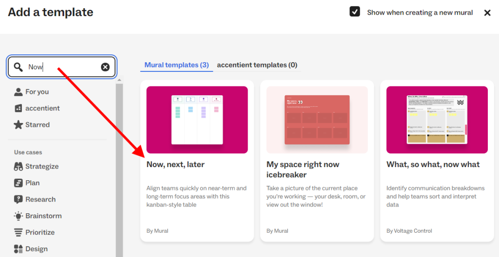</figure>

There are several different types of agile roadmaps that a team can use to visualize items from the Product Backlog. This <a href="https://www.savio.io/product-roadmap/roadmap-types/" title="page">page</a> does a good job of detailing and describing most of them. Mural offers many templates, but not necessarily one for each type of roadmap. New ones can be <a href="https://support.mural.co/s/article/create-a-template-from-your-mural" title="created ">created </a>of course.

The <em>Now, next, later</em> template is one of the out-of-the-box templates. I like this one, because it's quite simple and can be used by a Product Owner to facilitate a conversation with stakeholders without a lot of training or explaining.

<figure class="wp-block-image size-full has-custom-border">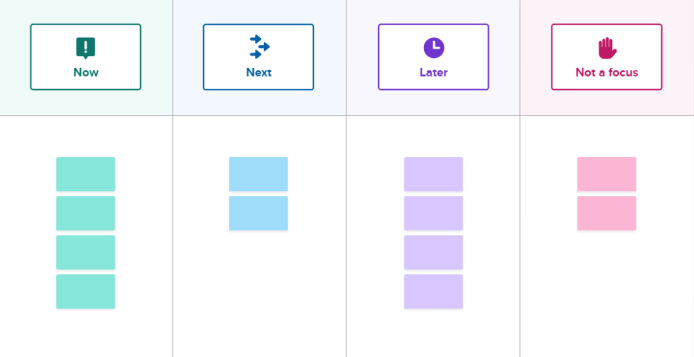</figure>

This roadmap is a strategic planning tool used to outline a product's short, medium, and long-term plans. Here's a breakdown of each section:

<ul>
<li>Now: This section is dedicated to the items selected (forecasted) in the current Sprint. These are items that are crucial to achieving the Sprint Goal.</li>

<li>Next: This section is dedicated to the items planned for the next few Sprints beyond the current one. These are items that are crucial to achieve the Product Goal, even if they are still being refined. Scrum Teams can refer to items in this section in order to prepare, gather information, perform spikes, and plan effectively to get these items ready for an upcoming Sprint.</li>

<li>Later: This section is dedicated to the items which, although they still might map to the Product Goal, are further out from being developed. These items may even be included in a future release.</li>

<li>Not a focus: This section can be used for items that do not map to the Product Goal or are not planned for the current or future release.</li>
</ul>

<strong>Importing work items from Azure DevOps</strong>

Before I import work items, I'm going to delete the default stickies that were created with the template. This will ensure a clean Mural to work with. With my integration configured, I can just right-click on the Mural and <em>Import Azure DevOps</em>.

<figure class="wp-block-image size-full has-custom-border">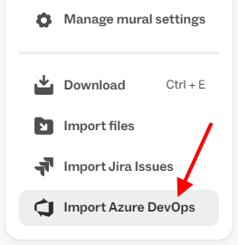</figure>

I select the organization, project, and work items. In my case, I'll use the <em>High ROI PBIs</em> query and then select all 25 of those items.

<figure class="wp-block-image size-large has-custom-border">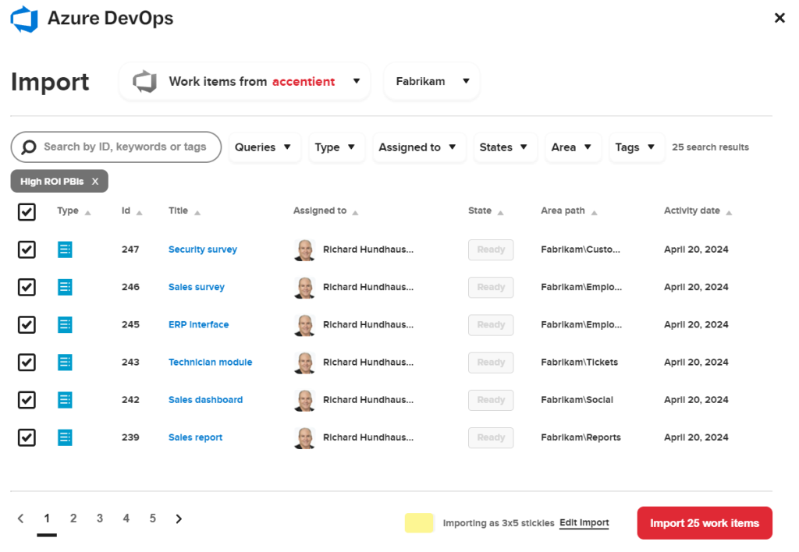</figure>

If I click <em>Edit Import</em> at the bottom, I can customize the stickies by selecting the size (3x3 square or 3x5 rectangle). Also, I can select which fields I want to import. Title will always be imported, but I also like to select these fields:

<ul>
<li>Area Path</li>

<li>Effort</li>

<li>ROI (custom field in my custom process)</li>

<li>State</li>
</ul>

😔 Unfortunately, <em>Business Value</em> was not deemed important enough to make it on the selection list for importing. I'm working with Mural on this.

The work items will be imported as stickies and these selected fields will be imported as tags on those stickies. When there are too many tags on a sticky or the text of the tags is long, they will collapse under a three-dot icon. To view the tags, click the icon.

<figure class="wp-block-image size-full">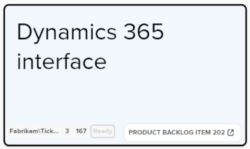</figure>

<strong>Building out the roadmap</strong>

The Product Owner can now collaborate with the stakeholders to visualize their <em>Now</em>, <em>Next</em>, <em>Later</em>, and <em>Not a focus</em> understanding.

<figure class="wp-block-image size-large has-custom-border">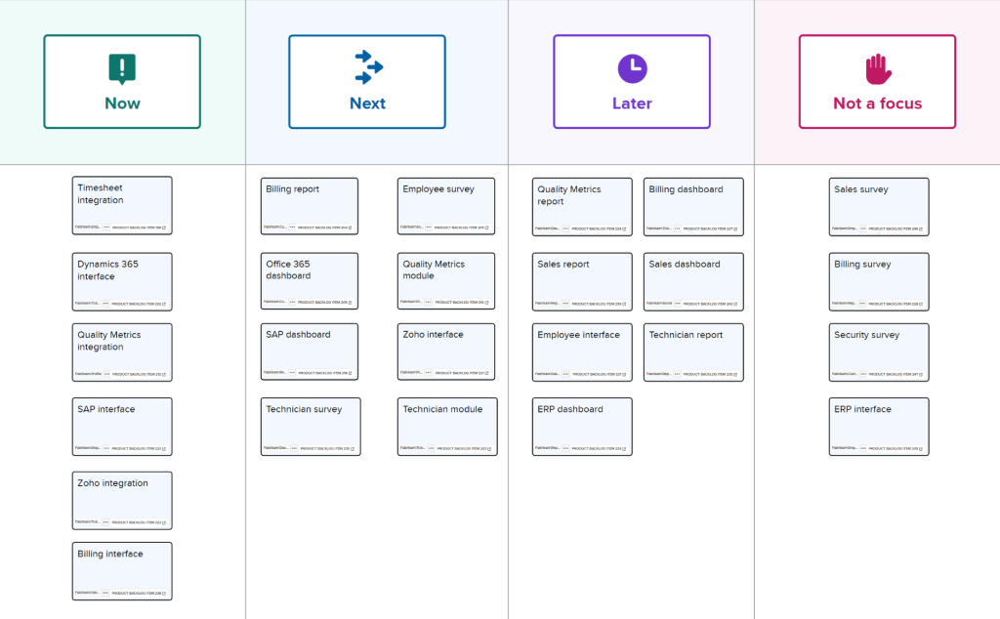</figure>

😔 Unfortunately there's no synchronization. If a work item changes in Azure DevOps, it must be imported again or manually kept in synch, and vice versa. Mural does make a link available in the bottom right of each card to open up the web page so you can make changes directly in Azure DevOps.

<figure class="wp-block-image size-full has-custom-border">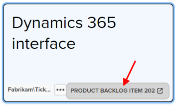</figure>

<strong>Create new Product Backlog items from stickies</strong> 

To create a work item from a sticky note, create the sticky note and add some text (which will become the title). Next, right-click on the new sticky note(s) and select <em>Send to Azure DevOps</em>. Just like before, you'll need to select the organization and project where you want to create new work items, but also the work item type (e.g. Product Backlog Item) and any additional fields.

<figure class="wp-block-image size-large has-custom-border">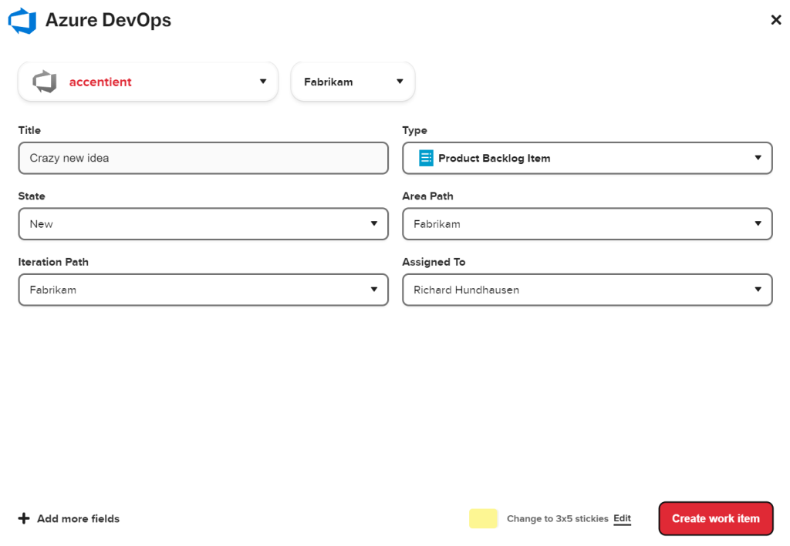</figure>

An Azure DevOps work item will be created for each sticky note. The sticky note(s) will also be converted to Azure DevOps work item sticky notes - with the appropriate tags.

<strong>Pretty slick, so what's missing?</strong>

I love the freeform nature of Mural. Once I import work items, I can arrange them any way I want. I can use a template or create my own. I can easily give stakeholders access to the Mural so that we can remotely collaborate. I can also restrict certain stakeholders from making changes.

That being said, I feel that the Mural integration with Azure DevOps is missing a few key capabilities ...

<ul>
<li>Support additional fields to import (e.g. Business Value)</li>

<li>Ability to right-click and refresh any changes from Azure DevOps</li>

<li>Ability to right-click and publish changes back to Azure DevOps</li>

<li>Support Azure DevOps integration for regions outside the United States </li>
</ul>

Maybe @Mural has these items on their own roadmap!

For more information, consult Mural's <a href="https://support.mural.co/s/article/azure-devops-admin-guide" title="Admin guide">Admin guide</a> or the <a href="https://support.mural.co/s/article/azure-devops-user-guide" title="User guide">User guide</a>.
