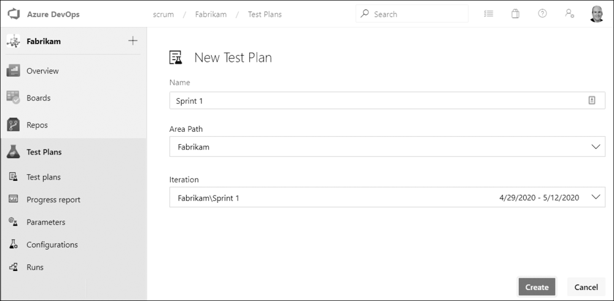

Most teams I meet think Azure Test Plans is simply about creating and running tests. That's how Microsoft promotes the product and how it tends to get demoed. It can certainly do those things. But it's also ideally suited for something far more interesting to a Scrum Team: representing the Sprint plan.

Here's the reframe. One of the outputs of Sprint Planning is the plan, which describes how the Developers will deliver the forecasted PBIs. Most teams use tasks. The <a href="https://scrumguides.org/" target="_blank" rel="noopener">Scrum Guide</a> is actually quiet on the subject, which means Developers are free to experiment. One option is to formulate the plan using acceptance tests. The Developers are going to have tests anyway, so why not start the Sprint by creating those tests and let them drive the development?

The mechanics are simple. Each Sprint, the Developers create one new test plan, and the name of that plan is just the name of the Sprint, such as "Sprint 2." That plan contains all the acceptance tests that prove the forecasted PBIs are Done, according to their acceptance criteria.

<figure class="wp-block-image size-large has-custom-border"></figure>

Do the math and you'll see how naturally this maps to a forecast. If a Sprint's forecast includes eight PBIs, each with five acceptance criteria, then the test plan will contain roughly 40 acceptance tests, give or take. You can create these during Sprint Planning even if only the test names are provided. The design of those tests may have started long before, perhaps during refinement.

<strong>Why this beats a wall of tasks</strong>

Tasks tell you how busy the Developers are. Acceptance tests tell you whether the product actually works. When the forecasted PBIs are expressed as failing acceptance tests, progress becomes obvious: the more passing tests, the more progress. Right after Sprint Planning there should be zero passing tests. By the end of the Sprint, hopefully, all of them pass.

One practical note on licensing. Developers who create and manage test plans and suites need the Basic + Test Plans license, which is included with Visual Studio Enterprise, Visual Studio Test Professional, and MSDN Platforms subscriptions, or can be purchased separately. If you can't create a new test plan, you probably don't have the right license, so check with your Azure DevOps administrator.

None of this is mandatory. Professional Scrum Developers can use whatever tools and practices they determine bring value and reduce waste. But if you're already living in Azure DevOps, you already own a tool that can hold your plan, prove your PBIs are Done, and inspect your progress along the way. Stop treating Test Plans as a testing afterthought.

Your Sprint plan and your tests living in the same place, driving the work. Sounds like good Scrum to me.

