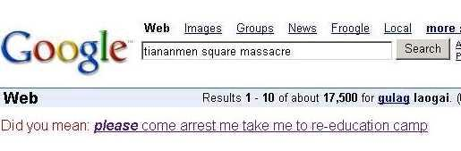

"Bend to Evil" is an anagram of Google's "Don't be Evil" byline.&nbsp; I generally hold Google in high regard for its strong vision of an interconnected world where information is free, open and shared.&nbsp; But I also understand their need to make money.&nbsp; Still, I'm disheartened by their decision to actively censor search results on their newly installed Chinese servers.&nbsp; The Chinese government believes concepts like freedom and democracy are not in the best interests of their subjects, and like any good nanny state, is trying to protect their people from these dangerous thoughts.&nbsp; Enter Google.&nbsp; Google, who proudly proclaimed that it did not censor search results, has decided that to best serve the Chinese market, they'll take direction from the Chinese government as to what people should be able to see.&nbsp; Now, i believe Google has good motives; you can read their defense <a href="http://googleblog.blogspot.com/2006/01/google-in-china.html">here</a>.&nbsp; However, I'm still dismayed for a few reasons:

<ol>
<li>Google has officially removed their Official Censorship statement.&nbsp; In their FAQ, they had&nbsp;a heading titled <strong>"Does Google censor search results?" </strong>The very first sentence was "Google does not censor results for any search term."&nbsp; The entire FAQ heading has now been removed.&nbsp; They didn't try to explain their position, or justify why they'2013-08-28 13:47:03've decided to censor.&nbsp; Instead, the FAQ term just disappeared.&nbsp; My question, if this was a common Frequently Asked Question before, do they really think it ISN'T now?&nbsp; (Read more: <a href="http://sayanythingblog.com/2006/01/27/google-pulls-official-censorship-statement/">here</a>)
<li>When a company decides to forgo one of their key foundation principles in pursuit of some other goal (profit, or new markets, or to benefit the Chinese people...), they are stepping down a slippery slope.&nbsp; Sure, maybe censoring for China isn't a big deal (and at least Google, unlike MSN or Yahoo! put a notice on the search results saying the results were censored), but once a concession has been made for China, how long before one is made for Saudi Arabia, Cuba, Canada, the United States?</li></ol>

Of course, there are lot's of folks poking fun, and I'd be remiss not to share a couple of those...&nbsp; Michelle Malkin is running a competition for new Google logos. You can find the first two batches <a href="http://michellemalkin.com/archives/004385.htm">here </a>and <a href="http://michellemalkin.com/archives/004394.htm">here</a>.&nbsp; I'll post just&nbsp;a couple...

