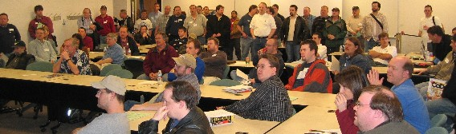
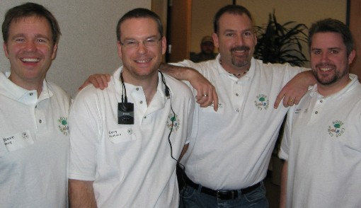

Yesterday's 'camp rocked! We had over 130 people attend, and ran several successful sessions throughout the day.

 Code Camp Attendees

 A few of the presenters (Steven Borg, Cory Isakson, Richard Hundhausen, Jason Mauer)
