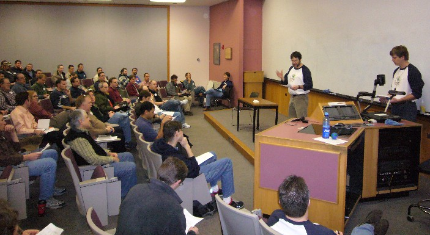
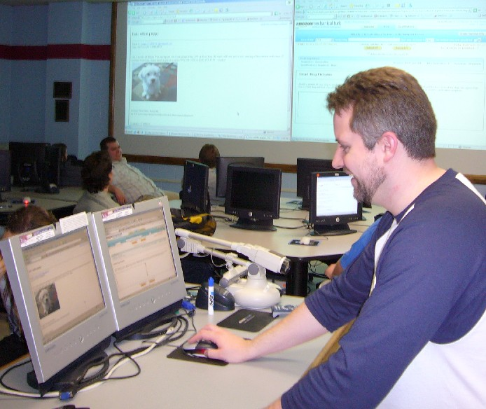
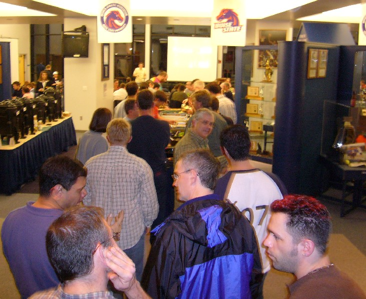

Wow, what a great 'camp! We had over 200 attendees (207 was the last number I heard) and many, many great sessions. Thanks to all of you who attended, helped coordinate, and SPOKE at the event!

 Rob Anson (BSU) welcomes students to the College of Business and Economics.

Personally, I enjoyed showing off PowerShell and getting some good feedback from fellow developers on how they might use it and what they thought the&nbsp;really cool featuers were. You can download my demo files <a href="CodeCampBoise2007PS.zip">here</a>. Also, the demo script for my&nbsp;SQL Server 2005 for Developers talk can be found <a href="CodeCampBoise2007SQL.zip">here</a>.

As for my third talk, co-presented with <a href="http://www.jasonmauer.com/" target="none" rel="noopener">Jason Mauer</a>, it&nbsp;didn't go as planned. We had intended to show off Amazon's Mechnanical Turk in the <a href="http://www.helpfindjim.com/" target="none" rel="noopener">search</a> for Dr. Jim Gray, Microsoft's missing researcher from Silicon Valley. When we got to the session, however, we read the announcement "<em>Satellite Image Examination Done! We've examined more than 560,000 images from 3 satellites, covering nearly 3,500 square miles of ocean! We currently do not need help here.</em>" Thanks to everyone (around 20) who showed up to the session to help! Instead, we spent some time discussing <a href="http://www.mturk.com/mturk/welcome" target="none" rel="noopener">Mechanical Turk</a>, <a href="http://www.amazon.com/gp/browse.html?node=16427261" target="none" rel="noopener">S3</a>, and other popular web services.

 Jason Mauer exploiting his dog for money on Mechanical Turk.
After the final session and closing "ceremonies", most of the attendees broke off and headed over to the <a href="http://www.broncosports.com/ViewArticle.dbml?DB_OEM_ID=9900&amp;KEY=&amp;ATCLID=611747" target="none" rel="noopener">Allen Noble Hall of Fame</a> building for a great dinner and some giveaways. Thanks to the sponsors: Micron, Microsoft, Keynetics, Treetop Tech, and healthwise!  