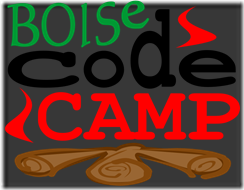
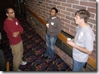
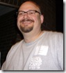
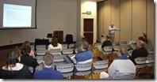
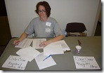
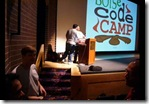

I had a lot of fun this weekend hanging out with my fellow developers, speakers, and hungry-minds at the Boise Code Camp.
 

 
Here are a few photos and a small video of the welcome session attendees.
 <table cellspacing="0" cellpadding="2" width="600" border="0"> <tbody> <tr> <td valign="center" width="150"><a href="BCC2010AmitMithunChris_2.jpg" target="_blank" rel="noopener"></a></td> <td valign="center" width="150"><a href="BCC2010HappyHost_2.jpg" target="_blank" rel="noopener"></a> </td> <td valign="center" width="150"><a href="BCC2010OleDam_2.jpg" target="_blank" rel="noopener"></a> </td> <td valign="center" width="150"><a href="BCC2010Elle_2.jpg" target="_blank" rel="noopener"></a></td> <td valign="center" width="150"><a href="BCC2010Welcome_2.jpg"></a> </td></tr> <tr> <td valign="center" width="150">Amit, Mithun, and Chris </td> <td valign="center" width="150">David Starr our happy host</td> <td valign="center" width="150">Ole Dam discusses leadership</td> <td valign="center" width="150">Elle runs a tight ship</td> <td valign="center" width="150">Welcome session (.wmv)</td></tr></tbody></table> 
 Also, for those of you who attended my presentations, here are links to the demo files:
 <ol> <li><a href="bcc2010tdd.zip" target="_blank" rel="noopener">TDD in Visual Studio 2010</a></li> <li><a href="bcc2010bts.zip" target="_blank" rel="noopener">Build It, Test It, Ship It</a></li></ol>