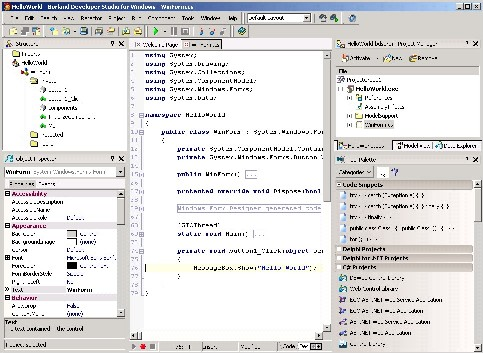

Otherwise known as the next version of Delphi. It'll do Delphi Win32, Delphi .NET, and C# projects all under one IDE. There's support for refactoring and ASP.NET as well. Here's a quick screenshot:
