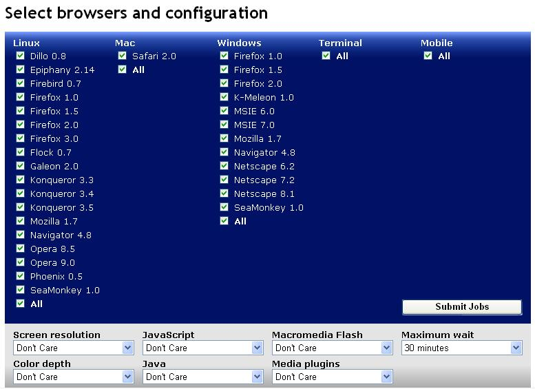

If you're building a web site that needs to be viewed in multiple different browsers, it has been difficult in the past to really get a good test.&nbsp; No longer.&nbsp; A site called <a href="http://browsershots.org">BrowserShots.org</a>&nbsp;provides a way to view screenshots of a web page as seen from over 30 different types of browsers.&nbsp; They actually run the site in the browser, take a screenshot, and post it.&nbsp; Pretty amazing!&nbsp; Here's a list of the browsers and options you can choose from.&nbsp; Color me impressed!
