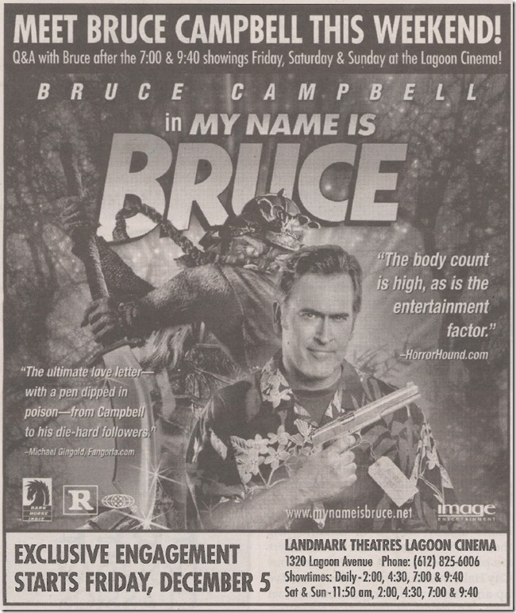
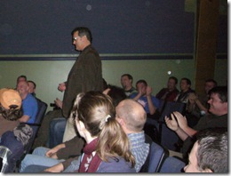
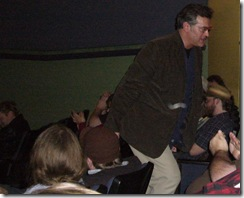

A couple weeks ago I was in Minneapolis on a gig. Planning to fly out Saturday morning, I looked for something to do Friday night. I found this ad in the local paper:
 
 
 
So I ran down and bought a ticket to the Friday 9:40 show. I'm a big fan of <a href="http://www.bruce-campbell.com" target="_blank" rel="noopener">Bruce Campbell</a>, and his ever "B" movies. In fact, a little know piece of trivia is that I named my malamute "Brisco" after <a href="http://www.theoasis.com/brisco" target="_blank" rel="noopener">Brisco County Junior</a>. So, in addition to enjoying the <a href="http://www.bruce-campbell.com/pilot.asp?pg=mnib" target="_blank" rel="noopener">My Name is Bruce</a> movie - which was about Bruce Campbell playing an horror-movie actor who gets asked to fit a real-life zombie. Ya, I know.
 
After the movie, Bruce appeared, joked a bit, and then started answering questions. I asked about the status of <a href="http://www.bubbanosferatu.com" target="_blank" rel="noopener">Bubba Nosferatu</a>, and he said that he wasn't going to have any part in it, but that Paul Giamatti and Ron Perlman were involved. Here's a couple of (poor quality) photos of Bruce at the theater and an Apple MOV file (43mb) of him answering some questions (video bad, sound good).
 <table cellspacing="0" cellpadding="2" width="400" border="0"> <tbody> <tr> <td valign="top" width="200"></td> <td valign="top" width="200"> </td></tr></tbody></table>