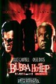

Yippee! <a href="http://www.bruce-campbell.com/" target="none" rel="noopener">Bruce Campbell</a> is making another movie called <a href="http://imdb.com/title/tt0457295/" target="none" rel="noopener">Bubba Nosferatu</a>, which is the prequel to (the really horrible B-movie) <a href="http://www.imdb.com/title/tt0281686/" target="none" rel="noopener">Bubba Ho-tep</a>. I find it interesting that <a href="http://www.paul-giamatti.net/" target="none" rel="noopener">Paul Giamatti</a> (an Academy award winner, btw) is also in the film. Maybe it won't be so bad! Here's the plot outline: this prequel to Bubba Ho-Tep finds Elvis shooting a film in Louisiana when he runs afoul of a coven of she-vampires.

You can find more on Bubba Noserferatu here: <a href="http://www.bubbanosferatu.com" target="none" rel="noopener">http://www.bubbanosferatu.com</a>

And more&nbsp;on the original Bubba Ho-tep here: <a href="http://www.bubbahotep.com/" target="none" rel="noopener">http://www.bubbahotep.com</a>
