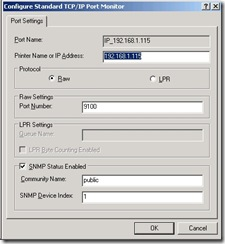
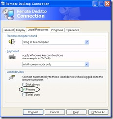
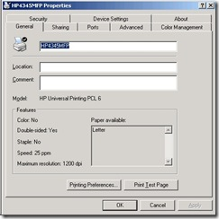
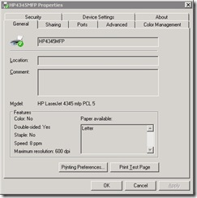
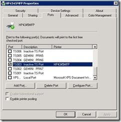

This is a very popular question on various forums, but none of them exactly answered the problem for my situation, so I wanted to share my approach.
 
<u>Scenario</u>
 <ul> <li>Windows Server 2003 (local)</li> <li>Windows Server 2008 (remote)</li> <li>HP4345MFP installed on my (local) home network at IP Address 192.168.1.115 port 9100</li></ul> <blockquote> 
 
</blockquote> <ul> <li>I'm sitting at the (local) 2003 server and when I remote desktop (RDP) into my (remote) 2008 server I want to print locally to my HP. Seems like a common use case, but I couldn't get it work for the life of me, until today.</li></ul> 
<u>Fix Attempt 1</u> - Enable local devices (didn't help)
 
Checked the box on the Remote Desktop Connection options to enable local printer devices.
 
 
 
<u>Fix Attempt 2</u> - Try fix mentioned in article <a href="http://support.microsoft.com/?kbid=302361" target="_blank" rel="noopener">302361</a> (didn't help)
 
The article mentioned a registry hack, which I tried even though it said that (local) Windows Server 2003 machines were exempt from needing the fix.
 
<u>Fix Attempt 3</u> - Install the HP4345 driver on the (remote) Windows Server 2008 (didn't help)
 
This step made sense to me, because the applications local to the remote server would need to have a local driver to print against. I installed the HP LaserJet 4345 mfp PCL 5 driver, but it didn't help. I left the driver on there.
 
<u>Fix Attempt 4</u> - Rename the printer to the exact same name as on the local machine (didn'2013-08-28 18:17:53't help)
 
I found a couple of threads that mentioned this, so I did it. I named the (remote) Windows Server 2008 printer HP the same name as the (local) Windows Server 2003 printer: <em>HP4345MFP</em>.
 <table cellspacing="0" cellpadding="2" width="400" border="0"> <tbody> <tr> <td valign="top" width="200"></td> <td valign="top" width="200"></td></tr> <tr> <td valign="top" width="200">Local HP4345MFP Properties</td> <td valign="top" width="200">Remote HP4345MFP Properties</td></tr></tbody></table> 
<u> Fix Attempt 5</u> - Change the port of the Remote HP4345 printer (<strong>Success!</strong>)
 
My last resort was going to be to configure the server to connect back through the Internet to my home network, opening up port 9100 to the world. While researching this, I came across a possible solution. Thinking that the remote desktop session would provide some hooks into my local machine's ports, I opened the Properties window of the remote printer (as Administrator) and started going down the list of interesting ports beginning with TSXXX. Some of these were titled Inactive TS Port and some had "Gemini" in the description. Gemini is the name of my local computer, so I knew I was close. I started checking boxes and doing trial prints, until the LaserJet came to life. For me, TS003 was the winner!
 

