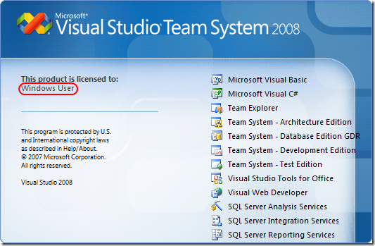
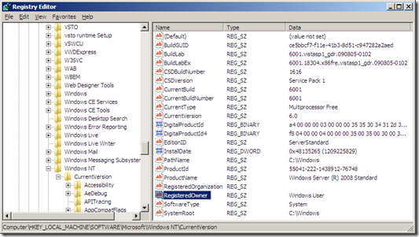

If you’re like me, then you don’t pay attention when you install a lot of software. Often times I just click Next > Next > Finish without reading the screens.
 
For example, I guess I wasn’t paying attention to who the registered user was when I installed Visual Studio 2008 or Windows for that matter, because the splash screen shows this:
 
 
 
Yes, it’s a registry setting and you can find/set it here:
 
<strong>HKEY_LOCAL_MACHINESOFTWAREMicrosoftWindows NTCurrentVersionRegisteredOwner</strong>
 
 
 
Unfortunately, changing it didn’t do anything, until I learned the trick from <a href="http://www.wintellect.com/CS/blogs/jrobbins/default.aspx" target="_blank" rel="noopener">John Robbins</a> (Wintellect):
 
After you change HKEY_LOCAL_MACHINESOFTWAREMicrosoftWindows NTCurrentVersionRegisteredOwner, restart Windows and then run "<strong>DEVENV /setup</strong>" from an elevated PowerShell window. That will update the splash screen registry key.