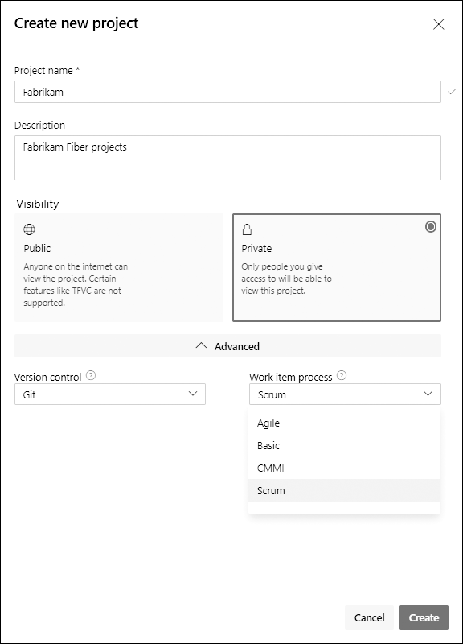

Every Azure DevOps project starts with a decision that most teams make in about four seconds and then live with for years. When you create a new project, you have to pick a process. That process defines your work item types, your workflow states, and your backlog configuration. It quietly shapes how your team thinks and talks about work from that day forward.

There are four system processes available out of the box, and they exist to meet the needs of most teams.

<figure class="wp-block-image size-large has-custom-border"></figure>

<ul>
  <li><strong>Basic</strong> is the most lightweight. It tracks work using issues, tasks, and epics, and it closely matches GitHub's work item types. It's also the default, so a lot of Basic projects exist by accident.</li>
  <li><strong>Agile</strong> is a bit heavier and supports many agile method terms, including User Stories.</li>
  <li><strong>Scrum</strong> is for teams that practice Scrum and track Product Backlog Items on the backlog and boards. It's nearly as lightweight as Basic.</li>
  <li><strong>CMMI</strong> is for teams that follow more formal methods requiring a framework for process improvement and an auditable record of decisions.</li>
</ul>

I've helped hundreds of teams stand up Azure DevOps, and I can count the CMMI projects I've run into on one hand. It's heavy and formal, with Change Request, Review, and Risk work item types. Most teams don't need any of that.

<strong>Why a Scrum Team should choose Scrum</strong>

If you practice <a href="https://scrumguides.org/" target="_blank" rel="noopener">Scrum</a>, choose the Scrum process. It was designed from the ground up to embrace the rules of Scrum, the result of collaboration between Microsoft, Scrum.org, and the Professional Scrum community. More than 100,000 teams downloaded the original template in its first couple of years, and they liked it precisely because it was barely sufficient.

The Agile process is very similar under the hood. The real difference is language. Agile calls its requirement a User Story and its blocker an Issue. Scrum calls them a Product Backlog Item and an Impediment. Those names matter. Software is built and delivered by people, not tools, and the words your tool puts in front of those people reinforce a mental model every single day. A Scrum Team staring at "User Story" all Sprint is being nudged, gently, away from its own vocabulary.

One more thing, and it's the part teams forget. The choice is hard to undo. The process you pick at creation defines the work item types and states the project will use from then on. Switching later means migrating to a different process and reconciling whatever doesn't line up. It's far easier to start in the right place.

Pick Scrum, speak Scrum, and let the tool stay out of your way. Sounds like good Scrum to me.

