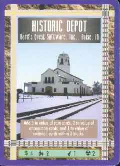
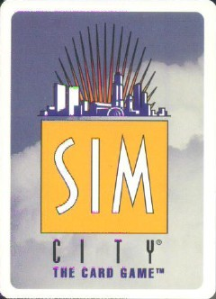
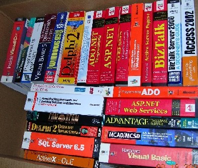
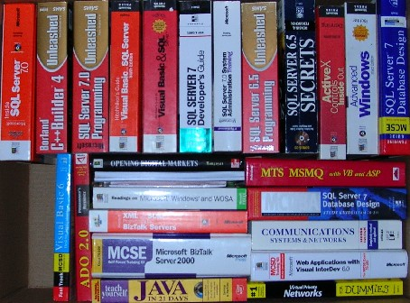

Ok, this sounds like one of those useless blog posts about what I had for breakfast this morning or can you guess what I have stuck to the bottom of my shoe? Well, maybe it will be a post like that, I guess it depends on your perspective.

Going through my garage, organizing my camping gear, I found one of these <a href="http://www.mayfairgames.com/mfg-shop/ccgs/simcity/qps/mfg-about.html" target="none" rel="noopener">SimCity "The Card Game"</a> promotional <a href="http://www.mayfairgames.com/mfg-shop/ccgs/simcity/qps/mfg-scltd.html" target="none" rel="noopener">cards</a> we had created from when we owned the Bard's Quest and Bard's Quest Software, back in the mid-1990s. It was the <a href="http://www.mayfairgames.com/mfg-shop/ccgs/simcity/pics/9800-ffl.jpg" target="none" rel="noopener">"Historic Depot"</a> card and could actually be used when playing the game.

 

I also donated fifty (five zero) technical books to the <a href="http://www.boisepubliclibrary.org/" target="none" rel="noopener">Boise Public Library</a> last night. It was sad to let them go, because I spent many a cold night curled-up next to my Inside SQL Server 6.5 book, learning the intricacies of locking. My apologies to my author friends if your books got "repurposed" last night.

 (Click to enlarge)