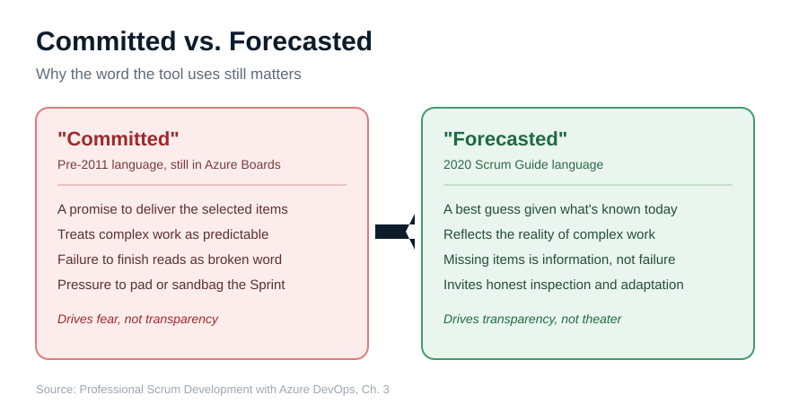
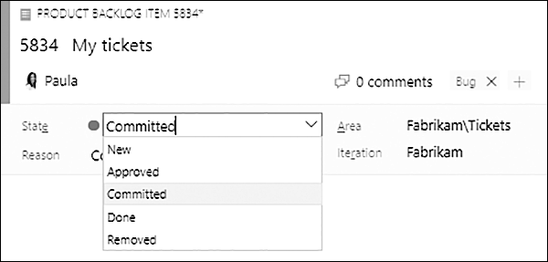

Open a PBI in the Scrum process, walk its workflow states, and you'll hit one that hasn't aged well: Committed. It's a small word on a drop-down, and it carries a decade of disagreement.

<figure class="wp-block-image size-large has-custom-border"></figure>

One of the most controversial updates to the 2011 <a href="https://scrumguides.org/" target="_blank" rel="noopener">Scrum Guide</a> was removing the term "commit" in favor of "forecast" for the work selected in a Sprint. Before that change, practitioners used to say the Development Team commits to the items it will deliver by the end of the Sprint. Scrum now calls that selection a forecast, because forecast better reflects the reality of doing complex work in a complex domain.

<strong>Why the word matters</strong>

This isn't pedantry. "Commit" implies a promise, and a promise implies certainty. But the whole reason we use Scrum is that the work is uncertain. When you forecast, you're making your best informed prediction with the knowledge you have right now, and everyone understands it may shift as you learn. When you commit, you set a trap. Stakeholders hear a guarantee. Developers feel the pressure of one. And when reality intervenes, as it does in complex work, the team is suddenly explaining a "broken commitment" rather than adapting a forecast. The word quietly undermines the empiricism the framework depends on.

Microsoft never updated the Scrum process to match. The Scrum community has had to put up with the Committed workflow state ever since.

<figure class="wp-block-image size-large has-custom-border"></figure>

The typical PBI progression in the Scrum process is New, Approved, Committed, Done. A PBI moves to Committed when the Developers forecast to develop it in the current Sprint. So the tool is using the word "committed" to describe the exact act that Scrum renamed to "forecast" years ago. That's the drift in one screenshot.

<strong>How to fix it</strong>

You don't have to accept the language. Create an inherited process from the Scrum process and adjust the workflow states. I add two new states, Ready and Forecasted, mapping Forecasted to the In Progress state category and keeping the default colors. Then I hide Approved and Committed, replacing them with Ready and Forecasted. The progression becomes New, Ready, Forecasted, Done, which is exactly what the team means.

While I'm in there, Approved gets the same treatment. Approved isn't terrible, but Ready is preferred, and older Scrum Guides even spoke of items being deemed "Ready" for selection in Sprint Planning.

Tools shape how people think. Make yours say "Forecasted," and the rest of the conversation gets a little more honest.

