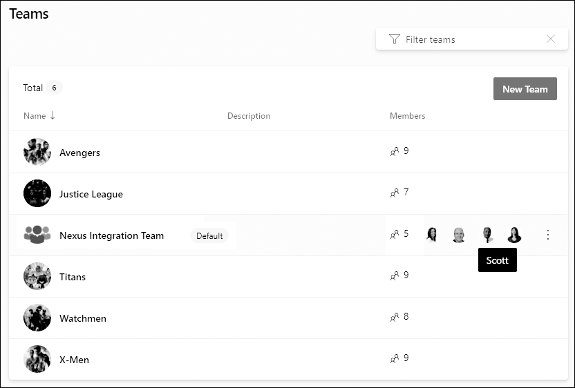

When you create an Azure DevOps project, a single default team is created with the same name as the project. For single-team Scrum, you just add the Product Owner, Scrum Master, and Developers to that team and you're off. Backlogs, boards, and dashboards are configured automatically. But the moment you need more than one Scrum Team in one project, you start touching Boards team configuration, and that's where people trip.

A Project Administrator creates additional teams, giving each a custom, filtered view of the overall Product Backlog. Select a short, unique name, pick the members, and identify team administrators. I'm a fan of making team members Project Administrators as well, so the tool never blocks them. Each team gets its own suite of agile tools that automatically filter the work items they display based on a few key settings. Those settings are exactly the ones that trip teams up.

<figure class="wp-block-image size-large has-custom-border"></figure>

<strong>Areas determine what a team sees</strong>

This is the big one. A team's selected areas determine which work items appear on that team's backlog. When you create a team, Azure DevOps offers to create a similarly named area path at the same time, which ensures a strong connection between teams and areas. After teams exist, you move existing product areas under those team areas to establish the ownership hierarchy. Then, in each team's configuration, you select which areas it covers, including sub-areas. Multiple teams can even cover the same area. Get this wrong and a team either sees nothing or sees the whole project. Two gotchas: renaming a team does not rename its area path, you have to do that by hand, and if you don't include sub-areas, work items added under new child areas won't show on the backlog.

<strong>Iterations control planning</strong>

Iterations (Sprints) are defined once at the project level, and then each team selects the ones it wants active. Each team also sets a default iteration and a backlog iteration. The default iteration is auto-assigned to work items created from the team context. Watch the @CurrentIteration default here: it assigns new PBIs to the current Sprint, which is confusing, since PBIs added to the Product Backlog should sit at the iteration root with no Sprint until they're forecasted in Sprint Planning.

<strong>Backlog behavior and administrators</strong>

In team configuration you also choose which backlogs the team uses (Epics, Features, and so on), set working days, and decide how bugs behave. And every team needs at least one Team Administrator to manage membership and configure these agile tools. Don't confuse the Team Administrator role with the Project Administrator permission group. Ideally everyone on the <a href="https://scrumguides.org/" target="_blank" rel="noopener">Scrum</a> Team is both, so nobody gets blocked.

Configure each new team's areas, iterations, and backlog behavior deliberately and the filtering just works. Skip a step and you'll spend a Sprint wondering where your PBIs went. Sounds like good Scrum to me.

