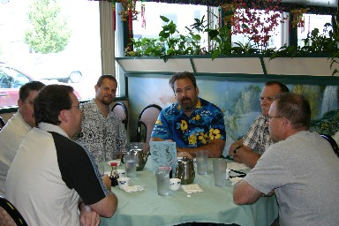

Some of my evangelist friends at Microsoft sponser geek dinners, nerd dinners, or pub-clubs, but in Boise, we have the Geek Lunch. We've been meeting sporadically, about once a month at our favorite Chinese restaurant downtown - The <a href="http://yellowpages.superpages.com/profile.jsp?SRC=portals&amp;T=Boise&amp;S=ID&amp;PP=N&amp;STYPE=S&amp;CID=493894&amp;LID=0017217980" target="none" rel="noopener">Oriental Express</a> (a.k.a. Jimmy's).

Here's a photo of Thursday's meeting. Seated from left to right (clockwise) is: <a href="http://blog.coryisakson.com" target="none" rel="noopener">Cory Isakson</a>, Paul Jenkins, Mike Hronek, (Me) Richard Hundhausen, Tim Schaaf, and <a href="http://blog.nationwidejava.com" target="none" rel="noopener">Ed Lance</a>. Kelly is taking the photo.
