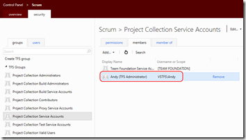
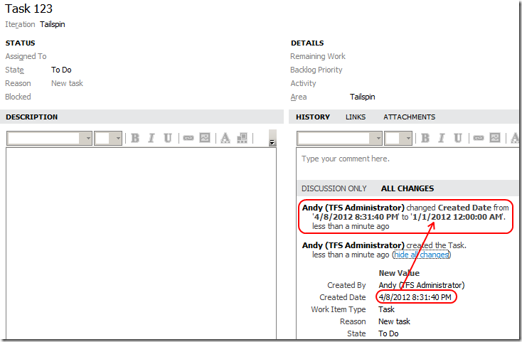

---
title: "Create Yesterday’s Work Items Today"
date: 2012-04-08T20:51:48Z
authors: ["Richard Hundhausen"]
slug: "create-yesterdays-work-items-today"
draft: false
tags: ["TFS", "Visual Studio"]
---

---

Team Foundation Server 11 has made it even easier to create a work item with a date prior to <em>today</em>. Awesome. So, why would you want to do this? Work with me here …
 
Maybe you are importing requirements, test cases, or bugs from another tool. Maybe you want to back-fill a Sprint backlog with tasks you were tracking by hand. Maybe you want to create a utility to automatically populate several sprints of work in order to generate and study the burndown and velocity reports. Ok, maybe that last one is just interesting for me as I’m writing my latest book.
 
Whatever the reason, the approach is not straightforward, so I thought I would share my failures (and ultimate success) with you.
 
<u>Start here</u>
 <ol> <li>Download and install the various Beta products (or download <a href="http://aka.ms/VS11ALMVM" target="_blank" rel="noopener">Brian Keller’s VM</a>). <li>Start Visual Studio 11 Beta. <li>Create a new C# console application (or class library, WPF app, Winforms app, etc.) <li>Add assembly references and USING statements for <em>Microsoft.TeamFoundation.Client</em> and <em>Microsoft.TeamFoundation.WorkItemTracking.Client</em>.<!--EndFragment--></li></ol> 
<u>Attempt #1: I tried the obvious</u> #FAIL
 <blockquote> 
TfsTeamProjectCollection tpc = new TfsTeamProjectCollection(new Uri("http://vstfs:8080/tfs/scrum")); tpc.EnsureAuthenticated(); WorkItemStore store = new WorkItemStore(tpc); Project tp = store.Projects; WorkItemType wit = tp.WorkItemTypes; WorkItem wi = new WorkItem(wit); wi.Title = "Task 123"; wi.CreatedDate = DateTime.Parse("01/01/2012"); // Cannot assign to this field; it is read-only; won’t even build wi.Save();
</blockquote> 
<u>Attempt #2: I tried using Fields collection instead</u>&nbsp;#FAIL
 <blockquote> 
TfsTeamProjectCollection tpc = new TfsTeamProjectCollection(new Uri("http://vstfs:8080/tfs/scrum")); tpc.EnsureAuthenticated(); WorkItemStore store = new WorkItemStore(tpc); Project tp = store.Projects; WorkItemType wit = tp.WorkItemTypes; WorkItem wi = new WorkItem(wit); wi.Title = "Task 123"; wi.Fields.Value = DateTime.Parse("01/01/2012"); // TF26194: The value for the field 'Created Date' cannot be changed wi.Save();
</blockquote> 
<u>Attempt #3: I tried using two distinct Save operations</u> #FAIL
 <blockquote> 
TfsTeamProjectCollection tpc = new TfsTeamProjectCollection(new Uri("http://vstfs:8080/tfs/scrum")); tpc.EnsureAuthenticated(); WorkItemStore store = new WorkItemStore(tpc); Project tp = store.Projects; WorkItemType wit = tp.WorkItemTypes; WorkItem wi = new WorkItem(wit); wi.Title = "Task 123"; 
wi.Save(); wi.Fields.Value = DateTime.Parse("01/01/2012"); wi.Save(); // TF237124: Work Item is not ready to save

</blockquote> 
<u>Attempt #4: I explored the BypassRules flag on the WorkItemStore</u>&nbsp;#FAIL
 <blockquote> 
TfsTeamProjectCollection tpc = new TfsTeamProjectCollection(new Uri("http://vstfs:8080/tfs/scrum")); tpc.EnsureAuthenticated(); 
 
WorkItemStore store = new WorkItemStore(tpc, WorkItemStoreFlags.BypassRules); Project tp = store.Projects; WorkItemType wit = tp.WorkItemTypes; WorkItem wi = new WorkItem(wit); wi.Title = "Task 123"; 
wi.Save(); // TF26212: Team Foundation Server could not save your changes. wi.Fields.Value = DateTime.Parse("01/01/2012"); wi.Save();

</blockquote> <blockquote> 
This was a different error message, so I knew I was getting close. I traded emails with someone on the Visual Studio product group and he walked me in. It turns out that the user (or service account) running the above code must be a member of the <em>Project Collection Service Accounts</em> group. This can be set from either the Team Foundation Server Administration Console or from the web-based control panel. I opted for the web-based control panel and added my user account (Andy) to this group:
 

</blockquote> 
<u>Attempt #5: Added user to the Project Collection Service Accounts group</u> <strong>#SUCCESS</strong>
 <blockquote> 
As you can see, I was able to successfully change the Created Date to 1/1/2012 on the second Save operation. The fact that I had to perform two saves is messy, but I can live with it. I’m told that you can set the System.ChangedDate field this way too, but I’m running into similar blocks. Maybe it’s not working yet in the beta. We’ll see.
</blockquote> <blockquote> 

</blockquote> 
Disclaimer: This feature is intended primarily for synchronization and migration tools. These tools should typically be running as a service account in order to bypass the WI rules. I don’t recommend adding an individual user (like I did above) to the Project Collection Service Accounts group except for developing and testing. One option would be to use impersonation (of the service account) when connecting to the TPC.

