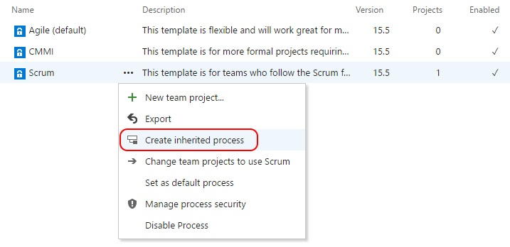
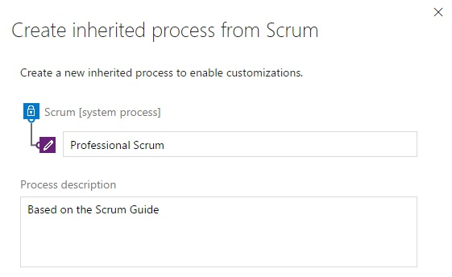
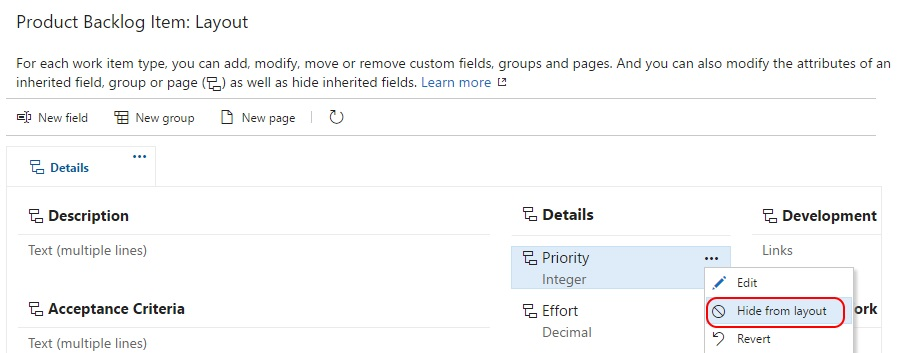
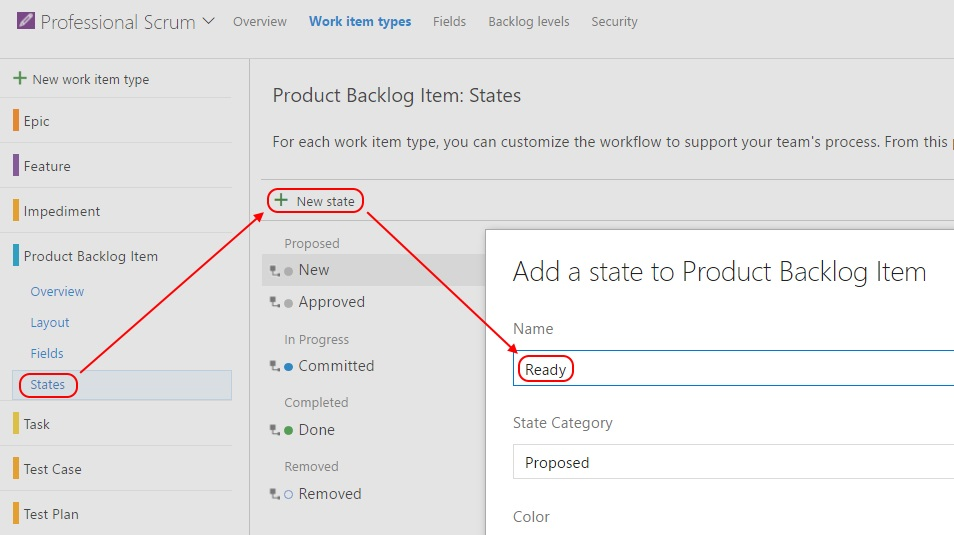
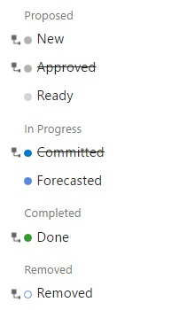
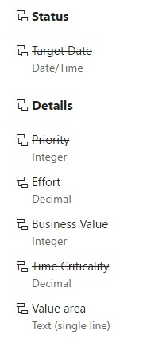
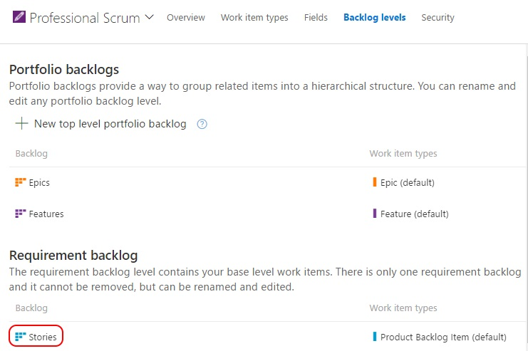
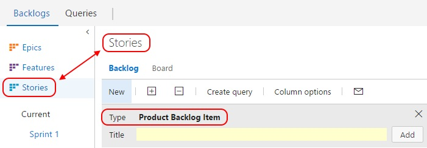
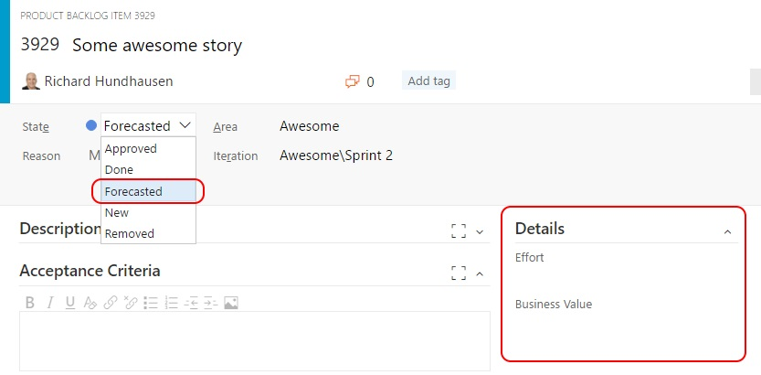
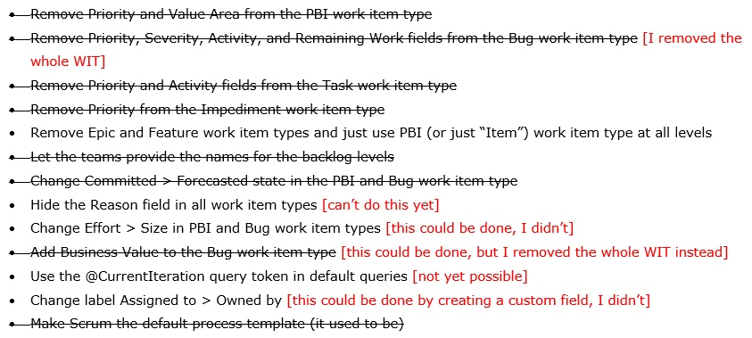

---
title: "Create a Professional Scrum process"
date: 2017-03-15T21:22:36Z
author: "Richard Hundhausen"
slug: "creating-a-professional-scrum-process-in-vsts"
draft: false
tags: ["Azure DevOps", "Scrum"]
---

---

Visual Studio Team Services' customization capabilities are to a point now where I can write this blog post ... as a rebuttal to any <a href="https://accentient.com/blog/microsoft-please-give-us-a-scrum-process-template/" target="_blank" rel="noopener noreferrer">earlier post</a> of my own. As you may know, the <a href="http://www.scrumguides.org/" target="_blank" rel="noopener noreferrer">Scrum Guide</a> has been <a href="http://www.scrumguides.org/revisions.html" target="_blank" rel="noopener noreferrer">updated</a> more frequently than Microsoft's <a href="https://www.visualstudio.com/en-us/docs/work/guidance/scrum-process" target="_blank" rel="noopener noreferrer">Scrum process</a> (template) which, when launched, was meant to be an exact implementation. It falls upon the community (me and you) to update the Scrum process ourselves. Maybe that was Microsoft's plan all along. :-)

Following the guidance <a href="https://www.visualstudio.com/en-us/docs/work/process/customize-process" target="_blank" rel="noopener noreferrer">here</a>, I've documented my journey to create a <em>Professional Scrum</em> process.

First, I created an inherited process based on the <em>Scrum</em> template ...

I named this inherited process "Professional Scrum" ...

After setting <em>Professional Scrum</em> as the default process, I began customizing it. I started by disabling the <strong>Bug</strong> work item type, because the <strong>Product Backlog Item</strong> WIT works just fine) ...

I customized the <strong>Product Backlog Item</strong> layout by hiding the <em>Priority</em> and V<em>alue Type</em> fields ...

Note: Ideally, I would have liked to remove these fields altogether, but that isn’t allowed today.

Next, I added two new states: <em>Ready</em> (which maps to the <em>Proposed</em> category) and <em>Forecasted</em> (which maps to the <em>In Progress</em> category) ...

I disabled the <em>Approved</em> and <em>Committed</em> states, replacing them with <em>Ready</em> and <a href="https://www.scrum.org/resources/commitment-vs-forecast-subtle-important-change-scrum" target="_blank" rel="noopener noreferrer"><em>Forecasted</em></a> respectively ...

Note: I could have created a similar state workflow for <strong>Epic</strong> and <strong>Feature</strong>, but didn't. You could.

I made similar changes to the <strong>Epic</strong> and <strong>Feature</strong> work item type, hiding <em>Target Date</em>, <em>Priority</em>, <em>Time Criticality</em>, and <em>Value Area</em> fields ...

I also hid the <em>Priority</em> and <em>Activity</em> fields from the <strong>Task</strong> WIT and <em>Priority</em> from the <strong>Impediment</strong> WIT. I then went to Backlog Levels and <a href="https://www.visualstudio.com/en-us/articles/news/2017/mar-08-team-services" target="_blank" rel="noopener noreferrer">renamed</a> the <em>Backlog items</em> level to <em>Stories</em> ...

Note: Although epics, features, and stories are <em>all</em> considered PBIs in Scrum, most teams I coach prefer to call the lowest level ("sprintable") backlog items as  stories. Ideally, all backlog levels would just use the Product Backlog Item WIT and then we could ditch or ignore <em>Epic</em> and <em>Feature</em> WITs altogether.

I then created a new team project based on the <em>Professional Scrum</em> template and beheld the awesomeness, such as "Stories" instead of "Backlog Items" and the Bug WIT being unavailable ...

"Forecasted" instead of "Committed" and a minimal Details section ...

So, let's revisit my checklist from my <a href="https://accentient.com/blog/microsoft-please-give-us-a-scrum-process-template/" target="_blank" rel="noopener noreferrer">earlier post</a> and see what's possible now ...

 Scrum on!

&nbsp;
