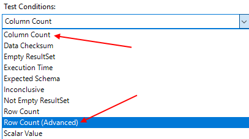
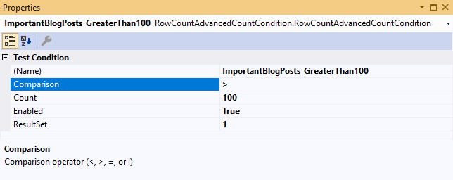
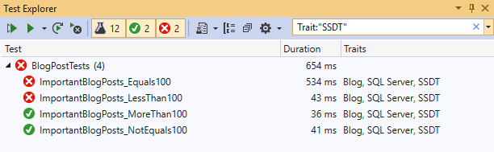

---
title: "Creating a Custom SSDT Test Condition"
date: 2019-10-09T16:47:39Z
author: "Richard Hundhausen"
slug: "custom-ssdt-test-condition"
draft: false
tags: ["SQL Server", "Visual Studio"]
---

---

I was teaching our new <a rel="noreferrer noopener" aria-label="SSDT2019  (opens in a new tab)" href="https://accentient.com/ssdt" target="_blank">SSDT2019</a> class today and, while discussing SQL Server Unit Testing, I was asked why the default <em>Row Count</em> <a rel="noreferrer noopener" aria-label="test condition (opens in a new tab)" href="https://docs.microsoft.com/en-us/sql/ssdt/using-test-conditions-in-sql-server-unit-tests#predefined-test-conditions" target="_blank">test condition</a> only tested for equality (and not less than, greater than, or inequality). I decided to build one that did just those things.

First, I dusted off the <a rel="noreferrer noopener" aria-label="old guidance (opens in a new tab)" href="https://docs.microsoft.com/en-us/sql/ssdt/custom-test-conditions-for-sql-server-unit-tests" target="_blank">old guidance</a> from (cough) 2012 and was amazed that the guidance still <em>mostly</em> applied. Using Visual Studio 2019, I created a new C# Class Library (.NET Framework) project named <em>CustomTestConditions</em>. I generated and associated a <a rel="noreferrer noopener" aria-label="strong name key (opens in a new tab)" href="https://docs.microsoft.com/en-us/dotnet/standard/assembly/sign-strong-name#create-and-sign-an-assembly-with-a-strong-name-by-using-visual-studio" target="_blank">strong name key</a> and then referenced System.ComponentModel.Composition and the Microsoft.Data.Tools.Schema.Sql.dll assembly.

Next, using the <a rel="noreferrer noopener" aria-label="ResultSetColumnCountCondition (opens in a new tab)" href="https://docs.microsoft.com/en-us/sql/ssdt/walkthrough-use-custom-test-condition-to-verify-stored-procedure-results?view=sql-server-2017#creating-the-resultsetcolumncountcondition-class" target="_blank">ResultSetColumnCountCondition</a>&nbsp;sample code as a base (I've included that one too), I created the <em>RowCount (Advanced)</em> test condition class with the following code:

<pre><code>using System;
using System.ComponentModel;
using System.Data;
using System.Data.Common;
using Microsoft.Data.Tools.Schema.Sql.UnitTesting;
using Microsoft.Data.Tools.Schema.Sql.UnitTesting.Conditions;

namespace RowCountAdvancedCountCondition
{
  &#91;System.ComponentModel.DesignerCategory("Code")]
  &#91;ExportTestCondition("Row Count (Advanced)", typeof(RowCountAdvancedCountCondition))]
  public class RowCountAdvancedCountCondition : TestCondition
  {
    private int _resultSet;
    private string _comparison;
    private int _count;
    private int _batch;

    public RowCountAdvancedCountCondition()
    {
      _resultSet = 1;
      _comparison = "=";
      _count = 0;
      _batch = 1;
    }

    public override void Assert(DbConnection validationConnection, SqlExecutionResult&#91;] results)
    {
      base.Assert(validationConnection, results);
      if (results.Length &lt; _batch)
        throw new DataException(String.Format("Batch {0} does not exist", _batch));

      SqlExecutionResult result = results&#91;_batch - 1];
      if (result.DataSet.Tables.Count &lt; ResultSet)
        throw new DataException(String.Format("ResultSet {0} does not exist", ResultSet));

      DataTable table = result.DataSet.Tables&#91;ResultSet - 1];

      if (_comparison == "&lt;" &amp;&amp; table.Rows.Count &gt;= _count)
        throw new DataException(String.Format(
            "ResultSet {0}: {1} rows was not less than the {2} columns expected",
            ResultSet, table.Rows.Count, _count));
      if (_comparison == "&gt;" &amp;&amp; table.Rows.Count &lt;= _count)
        throw new DataException(String.Format(
            "ResultSet {0}: {1} rows was not greater than the {2} columns expected",
            ResultSet, table.Rows.Count, _count));
      if (_comparison == "=" &amp;&amp; table.Rows.Count != _count)
        throw new DataException(String.Format(
            "ResultSet {0}: {1} rows was not equal to the {2} columns expected",
            ResultSet, table.Rows.Count, _count));
      if (_comparison == "!" &amp;&amp; table.Rows.Count == _count)
        throw new DataException(String.Format(
            "ResultSet {0}: {1} rows was equal to the {2} columns expected",
            ResultSet, table.Rows.Count, _count));
    }

    public override string ToString()
    {
      return String.Format(
          "Condition fails if ResultSet {0}'s row count is not {1} {2} rows",
          ResultSet, Comparison, Count);
    }

    #region Properties  

    &#91;Category("Test Condition")]
    &#91;DisplayName("ResultSet")]
    &#91;Description("ResultSet Number")]
    public int ResultSet
    {
      get { return _resultSet; }
      set
      {
        if (value &lt; 1)
          throw new ArgumentException("ResultSet cannot be less than 1");
        _resultSet = value;
      }
    }

    &#91;Category("Test Condition")]
    &#91;DisplayName("Count")]
    &#91;Description("Column Count")]
    public int Count
    {
      get { return _count; }

      set
      {
        if (value &lt; 0)
          throw new ArgumentException("Count cannot be less than 0");
        _count = value;
      }
    }

    &#91;Category("Test Condition")]
    &#91;DisplayName("Comparison")]
    &#91;Description("Comparison operator (&lt;, &gt;, =, or !)")]
    public string Comparison
    {
      get { return _comparison; }
      set
      {
        if (!"&lt;&gt;=!".Contains(value))
          throw new ArgumentException("Operation must be &lt;, &gt;, =, or !");
        _comparison = value;
      }
    }
    #endregion
  }
}</code></pre>

After creating a Release build, I copied the CustomTestConditions.dll assembly to the well known location. In my case, this was in the following folder:

<pre><code>C:\Program Files (x86)\Microsoft Visual Studio2019\Professional\Common7\IDE\Extensions\Microsoft\SQLDB\TestConditions</code></pre>

Your folder location may be different depending on the version and edition of Visual Studio you are using.

I started up a new instance of Visual Studio with SSDT, loaded a SQL Server Database project, added a SQL Server Unit Test and started enjoying my new test conditions.

With the new <em>Row Count (Advanced)</em> test condition selected, I am able to set the comparison operator (less than, greater than, equals, or not equals) accordingly.

I created four SQL Server Unit Tests using the new Row Count (Advanced) test condition and discovered that I, in fact, have published more than 100 important blog posts. :-)

The code can be found <a href="customtestconditions.zip">here</a>. Enjoy.

