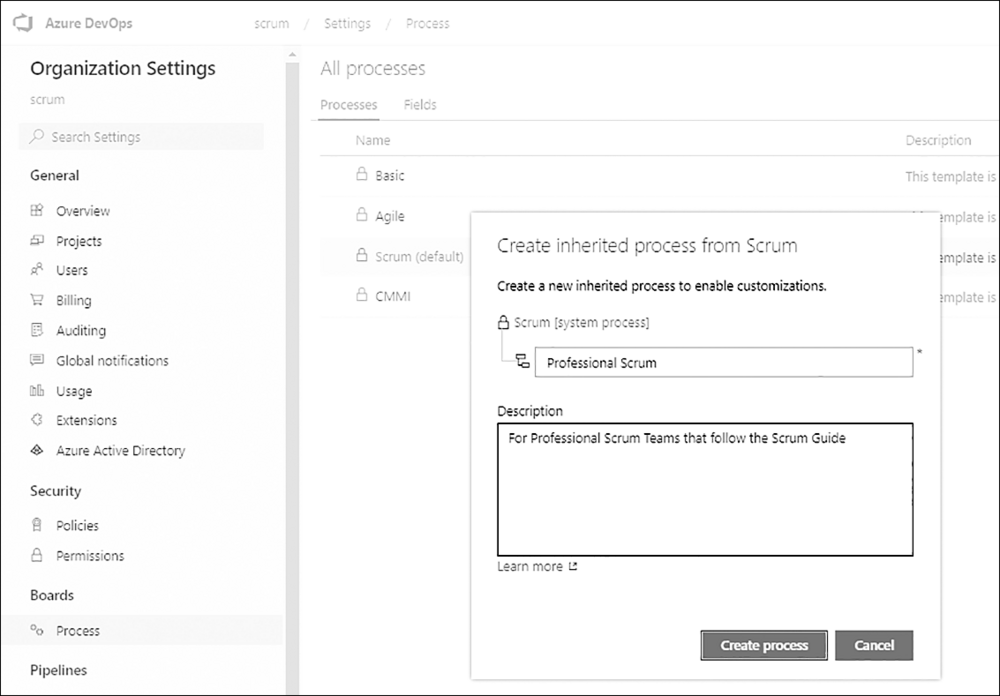
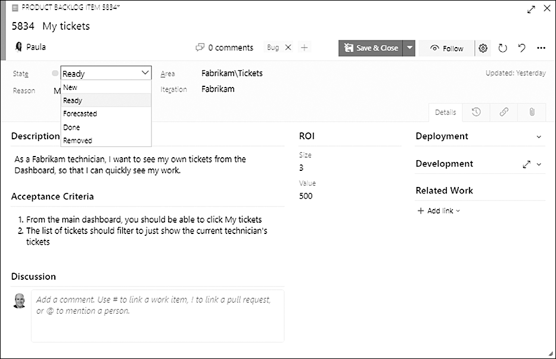

The Scrum process in Azure DevOps is the closest fit to the <a href="https://scrumguides.org/" target="_blank" rel="noopener">Scrum Guide</a> of any system process, but it isn't a perfect fit. Over the past decade the Scrum Guide evolved while the process largely stood still. The good news is that you don't have to live with the drift. You can customize the Scrum process to line it up with the Scrum Guide and with how your own team actually works.

You can't edit a system process directly. Instead, you create an inherited process based on one. Any changes you make to that inherited process automatically appear in every project that uses it, instantly. I select the Scrum process and create a child called Professional Scrum.

<figure class="wp-block-image size-large has-custom-border"></figure>

Process customization happens at the organization level, through an administrative web UI. The general sequence is straightforward: create the inherited process, customize its work item types and states, then apply it to new or existing projects and verify the results.

<strong>What I change</strong>

Once the inherited process exists and is set as the default, I make a handful of edits that pay for themselves.

<ul>
  <li>Disable the Bug work item type, so the team uses the PBI work item type for everything in the Product Backlog. Teams can add a "Bug" tag to those PBIs.</li>
  <li>Rename the Effort label to Size, which suits abstract estimation better than a label that invokes hours.</li>
  <li>Change the Business Value label to Value, because in Scrum value is value.</li>
  <li>Hide the Priority and Value Area fields from the form. I'd remove them outright if Azure Boards allowed it.</li>
  <li>Add Ready and Forecasted workflow states, then hide Approved and Committed.</li>
  <li>Hide the Priority and Activity fields from the Task work item type.</li>
  <li>Rename the lowest leaf-level backlog from "Backlog items" to "Stories," since in reality all backlog levels contain backlog items.</li>
</ul>

The result is a PBI form that says what a Scrum Team means.

<figure class="wp-block-image size-large has-custom-border"></figure>

One word of caution. Use the Scrum process the way it was designed for a few Sprints before you start bending it. I've watched teams rush to make a new project look exactly like their old one, dragging back fields like Original Estimate and Completed hours that were removed for good reason. Know what you're doing and why before you call it an improvement. Don't inadvertently change the rules of Scrum by customizing the tool.

Make the tool speak your language, then get back to building product.

