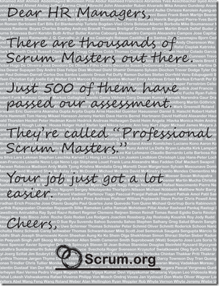

---
title: "Dear HR Managers"
date: 2010-09-21T07:06:27Z
authors: ["Richard Hundhausen"]
slug: "dear-hr-managers"
draft: false
tags: ["Scrum"]
---

---

I love this new letter to HR Managers (or anyone who wants to hire a ScrumMaster). It’s short and sweet.
 

 
Here’s the <a href="http://www.scrum.org/dear-hr-managers" target="_blank" rel="noopener">link</a> so you can use it yourself.

