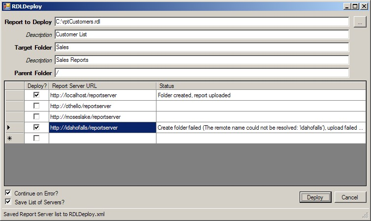

<strong>Updated Jan 2016</strong>: Fixed the link to the <em>Reporting Services Scripter</em> utility below.

Last week, while teaching a SQL Server 2005 Reporting Services class, I built this simple C# Windows forms application to help "push" an RDL report to multiple servers. It is a simple application that calls the CreateFolder and CreateReport Web methods on the ReportService2005 Web service. It's easy enough to customize for your purposes.

According to my students, this is a very common problem they face, as they have nine identical servers, with identical folder structures, and reports. They are generating and running scripts today, but wanted something more automated.

Feel free to download the <a href="RDLDeploy.zip">source code</a>.

I did find the <a href="https://sqlserverfinebuild.codeplex.com/wikipage?title=Install%20Reporting%20Services%20Scripter">Reporting Services Scripter</a> utility, which looked promising.