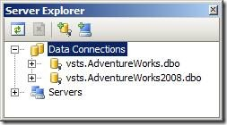

I’ve been doing a lot of work with the Database, er Development edition of VSTS 2008. Of course I’m running the <a href="http://www.microsoft.com/downloads/details.aspx?FamilyID=bb3ad767-5f69-4db9-b1c9-8f55759846ed&amp;displaylang=en" target="_blank" rel="noopener">GDR-R2</a> version which really changed the architecture of the database projects, as well as the process of building and deploying.
 
Prior to the GDR, if you deployed a database project it would automatically create a Data Connection in the Server Explorer window. I liked this, because I would almost always follow-up a first time deployment with some data generation or unit testing, and it just made it easier to select the pre-defined connection from the dropdowns. It seems that the GDR erased this timesaver. 
&nbsp; 
For example, I just deployed a GDR-R2 database project according to these settings: 
&nbsp; 
  
&nbsp; 
And when I go to the Server Explorer window, I don’t see my VSTSdev.AdventureWorks2009.dbo connection like I would have expected: 
&nbsp; 
 
&nbsp; 
Well it seems that this change was by design and it is configurable! According to <a href="http://blogs.msdn.com/vstsdb" target="_blank" rel="noopener">Duke Kamstra</a>, there’s a property in the database project (.dbproj) file that lets you control this behavior: 
&nbsp; 
<strong>&lt;DeployToDatabaseAddToServerExplorer&gt;False&lt;/DeployToDatabaseAddToServerExplorer&gt;</strong> 
&nbsp; 
If you set the property to True, the connection will get added to the list which Server Explorer displays, and the behavior I enjoyed prior to GDR will return. For added coolness, if you always want this behavior you could modify the template(s) that are instantiate dbproj file(s) from: C:Program FilesMicrosoft Visual Studio VSTSDBExtensionsSqlServerProjectItems**.dbproj 
&nbsp; 
Duke also tells me that the same property exists in Visual Studio 2010.
