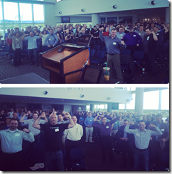

---
title: "Develop.Idaho 2014 Videos Published"
date: 2014-05-09T14:54:38Z
authors: ["Richard Hundhausen"]
slug: "develop-idaho-2014-videos-published"
draft: false
tags: ["Community", "Conferences", "Development"]
---

---

Updated 20 May: Added presentations (but no videos) from the "Business of Software" track.
 

 
It took a few extra days to get these produced and published, but they are now on YouTube for your enjoyment.
 <ul> <li><a href="https://www.youtube.com/watch?v=PPrZkGMqT6Y" target="_blank" rel="noopener">Welcome (Martin Hambalek)</a>  <li><a href="https://www.youtube.com/watch?v=cdWnTtET55g" target="_blank" rel="noopener">Keynote “It’s more than just writing code” (Ryan DeLuca)</a>  <li><a href="https://www.youtube.com/watch?v=sF_-OCLed9c" target="_blank" rel="noopener">“Data-driven decision making” (Dr. Vijay Dialani)</a>  <li><a href="https://www.youtube.com/watch?v=KQfEHX40QyY" target="_blank" rel="noopener">“The Rocket Ride” (Ryan Grisso)</a>  <li><a href="https://www.youtube.com/watch?v=7YWBGhn4io0" target="_blank" rel="noopener">“The new ‘Internet’ and how to leverage it” (Candace Sweigart)</a>  <li><a href="https://www.youtube.com/watch?v=-ey7JySW_vk" target="_blank" rel="noopener">“The Target breach was just the beginning” (Brad Wiskirchen)</a>  <li>“Preventing, Preparing For, and Protecting Your Company After a Data Breach” (Cece Gassner) <li>“The Role of Software in the ‘Automation of Normal’” (Randy Grohs) <li>“The Challenges of Moving from On-Premise to Cloud” (Jared Sund)</li></ul> 
I’ve attached links to the respective presentations. Hopefully you can correlate them with the videos.
 
<u>Update</u>: Ryan DeLuca shared his “developer posedown” photos he took right before his keynote …
 

