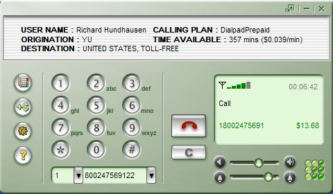

So as some of you know, I'm traveling overseas -- in Serbia right now, teaching a .NET architecture class for Microsoft.

So I wanted to call home, and didn't want to pay the 403 Yugoslavia Dinars/1st minute and 553 Dinars/extra minutes because this works out to be $7 and $9.5/minute respectively. I remembered using Dialpad.com (which was free at the time) when I lived in Germany. The quality was so-so, but it was nice to be able to call home for free. Now they are charging for the usage - $ 0.039/minute to call the states, which I'm more than happy to pay and the quality is excellent. Don't believe me? Let me give you call sometime - just email me.

Here's their interface:
