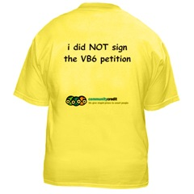

If you did <a href="http://classicvb.org/petition/" target="none" rel="noopener">sign the petition</a>, then&nbsp;you should probably get out more, and check out a cool&nbsp;technology called <a href="http://www.microsoft.com/net" target="none" rel="noopener">.NET</a>.

If you did not sign the petition, be proud and <a href="http://www.cafepress.com/devfish1.51135517" target="none" rel="noopener">show it</a> ...
