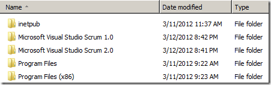
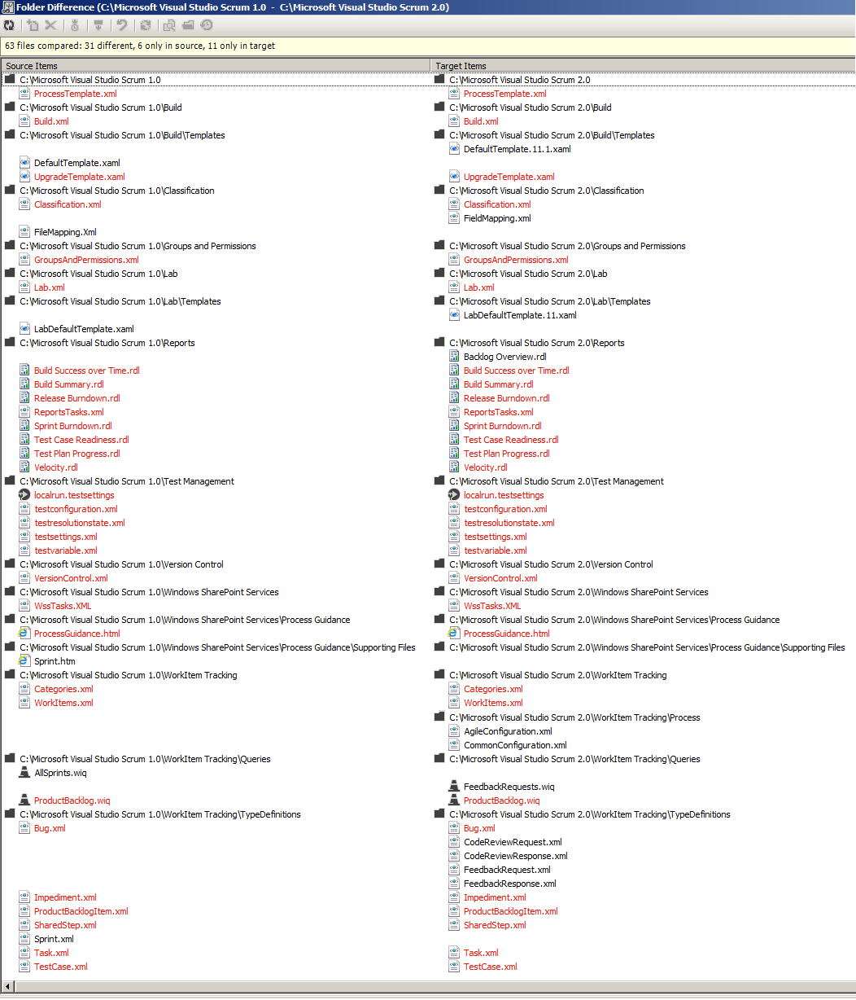
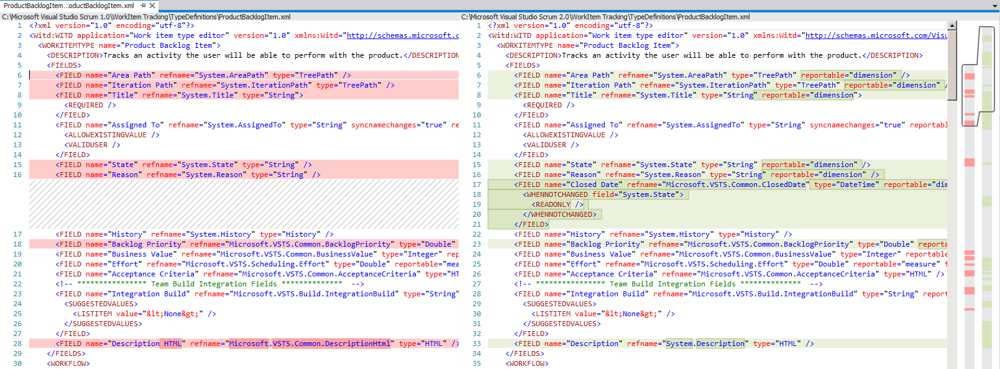
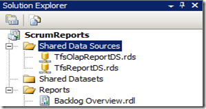
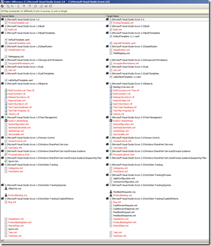
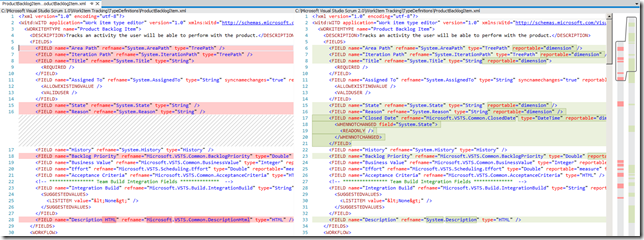
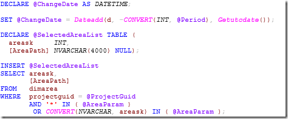

---
title: "Diving into the Visual Studio Scrum 2.0 Reports"
date: 2012-03-12T22:01:40Z
authors: ["Richard Hundhausen"]
slug: "diving-into-the-visual-studio-scrum-2-0-reports"
draft: false
tags: ["Scrum", "TFS", "SQL Server"]
---

---

Being the geek I am, I wanted to take a detailed look at the reports in the new Scrum template. Rather than wait for guidance to be posted, or call up my friends at Microsoft (again), I thought I would do my own experimenting.
 <ol> <li>I downloaded the Visual Studio Scrum 2.0 – Preview 3 process template from the <a href="https://accentient.com/blog/ct.ashx?id=4392387f-6cea-4f2c-9f43-f9189d3489c9&amp;url=http%3a%2f%2fwww.microsoft.com%2fvisualstudio%2f11%2fen-us%2fdownloads%23tfs" target="_blank" rel="noopener">Team Foundation Server 11 Beta</a> into C:Microsoft Visual Studio Scrum 2.0.  <li>I launched SQL Server Business Intelligence Development Studio (BIDS) otherwise known as Visual Studio 2008. (I can’t wait for this to be unified into one IDE someday).  <li>I created a new Report Server Project named <em>ScrumReports</em>.</li></ol> <blockquote> 

</blockquote> <ol start="4"> <li>From Windows Explorer, I dragged the eight .rdl reports …</li></ol> <blockquote> 

 
… into my Reports folder in Solution Explorer. This makes a copy of the .rdl files under my project.
 

</blockquote> <ol start="5"> <li>I then created two shared data sources with the <em>exact</em> names that the reports will expect.</li></ol> <ul> <ul> <li><strong>TfsOlapReportDS</strong>: a Microsoft SQL Server Analysis Services connection (<em>Data Source=vstfs;Initial Catalog=Tfs_Analysis</em>)  <li><strong>TfsReportDS</strong>: a Microsoft SQL Server connection (<em>Data Source=vstfs;Initial Catalog=Tfs_Warehouse</em>)</li></ul></ul> <blockquote> 

</blockquote> <ol start="6"> <li>Now I can open any of the reports in the designer and study the layout, built-in fields, parameters, and datasets. I can also preview the reports.</li></ol> <blockquote> 

</blockquote> <ol start="7"> <li>I then drilled-down into the various datasets to learn their purpose and how they fit with the report.</li></ol> <blockquote> 

 
For larger datasets with larger queries, I copied/pasted the code into this cool <a href="http://www.dpriver.com/pp/sqlformat.htm" target="_blank" rel="noopener">online SQL formatter</a> to improve readability:
 

</blockquote>
