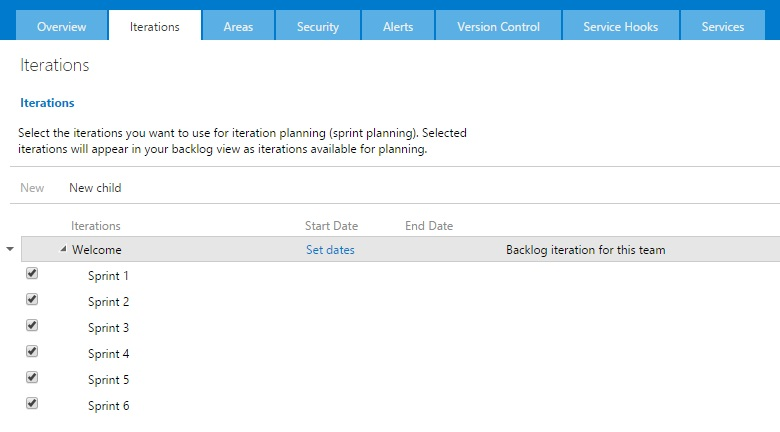
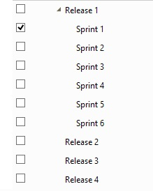

---
title: "Dude, where's my releases?"
date: 2015-09-21T19:09:39Z
author: "Richard Hundhausen"
slug: "dude-wheres-my-releases"
draft: false
tags: ["Azure DevOps", "TFS"]
---

---

You may have noticed when creating a new Scrum team project in Visual Studio Online or Team Foundation Server 2015, that the iteration list looks a bit different. Yes, Microsoft flattened out the list of iterations, listing only sprints and no more releases:

Previously, new team projects created using the Scrum process template would have default iterations like this:

I guess some customers had given feedback that by seeing release nodes in the iteration list it gave a false assumption that TFS/VSO supported release planning, which it doesn't.

If you miss the release nodes (as much as I do) then you can manually recreate them. It'll just take time.
