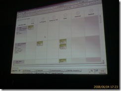

While at TechEd 2008 earlier this month I attended a presentation by <a href="http://blogs.conchango.com/colinbird/" target="_blank" rel="noopener">Colin Bird</a> where, among other things, he presented the next generation of the <a href="http://www.scrumforteamsystem.com/" target="_blank" rel="noopener">Conchango Scrum For Team System</a> process template. According to Colin, Conchango will continue to offer a free version of their scrum process template. But, they will also be offering for the first time an "enterprise" version that they will sell for a yet-to-be-determined fee. This enterprise version will contain an exciting new feature: and Electronic Scrum Board. This WPF application simulates the cork board and index cards that many scrum teams use to track the progress of their sprint. Each row represents a Product Backlog Item (also called a User Story)&nbsp;that describes a specific feature to be implemented, while each card represents a Sprint Backlog Item that describes a specific task. The columns on the board represent the various states for a Sprint Backlog Item. 

<table cellSpacing=0 cellPadding=2 width=627 border=0>
<tbody>
<tr>
<td vAlign=top width=253>&nbsp; </td>
<td vAlign=top width=372>

I took this shot while sitting next to <a href="http://elegantcode.com/2008/06/04/conchangos-scrum-process-template-21-for-team-system/" target="_blank" rel="noopener">David Starr</a> in the presentation, who also took a snap with his camera phone.  
</td></tr></tbody></table>

&nbsp;

When a card is dropped onto a row the board, it is automatically linked to the corresponding Product Backlog Item, and it's State is also updated automatically. This is sooo much more convenient that the current method of updating work items, and the board methaphor makes it much easier to visualize the overall status of the sprint.

I also happened to be part of the same lunchtime discussion of <a href="http://elegantcode.com/2008/06/08/electronic-scrum-boards-with-jeffrey-palermo/" target="_blank" rel="noopener">Electronic Scrum Boards with Jeffrey Palermo</a> that David blogged about. I respect Jeffrey's opinion very much, as well as Dave's reaction to Jeffrey's comments. But my take on the topic is slightly different.

As I recall, Jeffrey was not thrilled about the Electronic Scrum Board because a physical cork board works just fine. The cork board is simple and easy to use. It's highly visible to the scrum team and its stakeholders. Why go to the trouble and expense of implementing an inferior solution?

I get it. But I also beg to differ. First, let's assume that an organization has decided to use Team System work item tracking because it offers rich reporting of current and historical data, as well end-to-end traceability resulting from linking work items to changesets to builds to build verification tests. Now, if a scrum is using both work item tracking as well as a cork board, then the same information if being maintained redundantly. This being the case, it'2013-08-28 13:38:50's almost certain that the work items will be out of sync with the cork board some if not all of the time.&nbsp; With two conflicting views of project status, which one is authoritative? Which one do you believe?

Also, the cork board works great if the scrum team is co-located in one open space. Having all team members together in one location is ideal, but the reality is that a growing number of teams are geographically dispersed - sometimes in different parts of the world. For these teams, the cork board offers a poor solution.

Similarly, project stakeholders are often not in the same physical location as the cork board, making it difficult if not impossible for them to benefit from the information the cork board contains.

For these reasons, I believe that the Electronic Scrum board offers a superior solution. It not only shows current status, it also automatically maintains work item history. Analysis of this historical data can calibrate future estimates, enabling better sprint planning. Also, an Electronic Scrum Board offers a far more practical solution for teams that are not co-located.

Finally, I find it curious that scrum teams are in the business of creating automated solutions for others, but some of these same teams are loathe to give up their cork boards for an electronic version. Doesn't that seem&nbsp;just a&nbsp;bit ironic?
