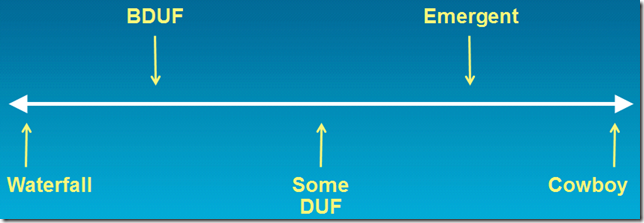

---
title: "Emergent Architecture Presentation at TechEd 2011"
date: 2011-06-01T19:09:58Z
authors: ["Richard Hundhausen"]
slug: "emergent-architecture-presentation-at-teched-2011"
draft: false
tags: ["Conferences", "Development", "Microsoft"]
---

---

UPDATE (3 June 2011): Watched the recorded presentation on <a href="http://channel9.msdn.com/Events/TechEd/NorthAmerica/2011/DPR308" target="_blank" rel="noopener noreferrer">Channel 9</a>.

I finally got my (final) Emergent Architecture (DPR308) presentation posted. I had a couple of people tell me that the deck they downloaded from the <a href="http://northamerica.msteched.com/modules/documentreview/default.aspx" target="_blank" rel="noopener noreferrer">TechEd Session Documents</a> page was an old one.

If you missed the presentation, you can <a href="http://northamerica.msteched.com/topic/details/DPR308" target="_blank" rel="noopener noreferrer">watch the video online</a> and see just where you are on the graph below!

Files: <a href="https://accentient.com/blog/ct.ashx?id=b29d0833-7f60-45bb-b898-0a431d642557&amp;url=http%3a%2f%2fblog.accentient.com%2ffiles%2fDPR308.pptx">Presentation (7mb)</a>
