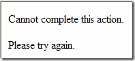
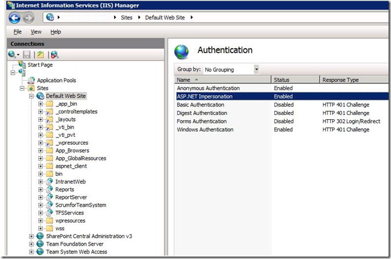
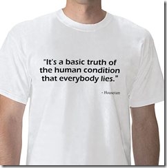

I was at a client site last month where they have TFS2008SP1 installed and running on Windows Server 2008 SP1. Everything <em>was</em> working fine. We created several team projects. No problems.

I come back three weeks later and it wouldn’t create a team project. I kept getting the "Project Creation Wizard encountered a problem while uploading documents to the Windows SharePoint Services server" error. According to the client, they hadn’t touched anything. So, I started with Ben Day’s <a href="http://blog.benday.com/archive/2008/10/20/23193.aspx" target="_blank" rel="noopener">blog post</a> on the subject, but his fix didn’t work for me. I then checked all the service accounts, permissions, farm administrator group, database status, etc. – all the standard things, but no help.

Come to find out none of the SharePoint collection/sites would come up, let alone allow me to create new ones. The Admin site worked, but every other site gave the "Cannot complete this action. Please try again" wonderfully helpful error message.

Windows event logs and SharePoint event logs were useless, but I did find a KB article talking about setting impersonation explicitly from code, so I decided to check the Authentication settings on the Default Web Site and sure enough it was Disabled. I changed it to Enabled, ran IISRESET for good measure, and voila!

I watch <a href="https://house.fandom.com/wiki/House_Wiki" target="_blank" rel="noopener">House</a> enough to know that "everybody lies". It’s a basic <a href="https://house.fandom.com/wiki/Houseism" target="_blank" rel="noopener">Houseism</a>. That was the case here. The "we didn’t touch anything" statement turned out to be false.

