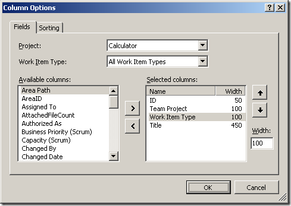
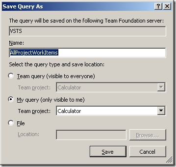
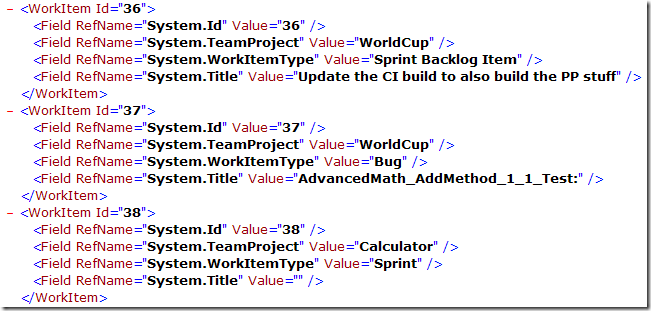

Somebody asked me a simple question the other day: "how do I export <em>all</em> of my work items at once". I suspected they were looking to perform a backup, but it sounded like they might want to import into another system or just archive them in some readable way. I suggested Microsoft Excel, but it can only fetch work items from one team project at a time. So repetition, using a Macro or a human, would be required.
 
Here’s an alternative we came up with …
 
1. Downloaded and installed <a href="http://msdn.microsoft.com/en-us/teamsystem/bb980963.aspx" target="_blank" rel="noopener">Team Foundation Power Tools</a>.
 
2. Picked one of the Team Projects, added a query, and removed the <strong>Team Project = @Project</strong> clause, so that it was completely empty:
 
&nbsp;&nbsp;&nbsp;  
 
3. Changed the <strong>Column Options</strong>, added the columns we wanted to export. For testing, we selected ID, Team Project, Work Item Type, and Title.
 
&nbsp;&nbsp;&nbsp; &nbsp;&nbsp; 
 
4. Ran the query and verified that it pulled the right work items and fields we wanted.
 
5. Saved the query (My query) and named it <strong>AllProjectWorkItems</strong>.
 
&nbsp;&nbsp;&nbsp;  
 
6. Dropped to the command prompt and executed the following commands:
 
<strong>&nbsp;&nbsp;&nbsp; cd c:Program FilesMicrosoft Team Foundation Server 2008 Power Tools </strong> 
<strong>&nbsp;&nbsp;&nbsp; tfpt query "CalculatorMy QueriesAllProjectWorkItems" /Server:vsts /format:xml &gt; c:AllWorkItems.xml </strong> 
&nbsp; 
7. This command generated an XML file containing all of the fields from all work items from all projects. This satisfied their requirement.
 
&nbsp;&nbsp;&nbsp;  
 
At this point you can update the query adding more columns, until you have the superset of what you need for the export of all types from all projects. With a little finesse, the XML document could be migrated into Excel or another software application.
