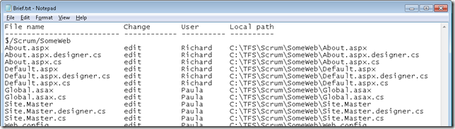
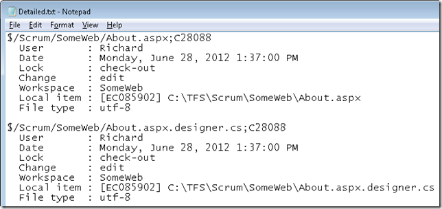
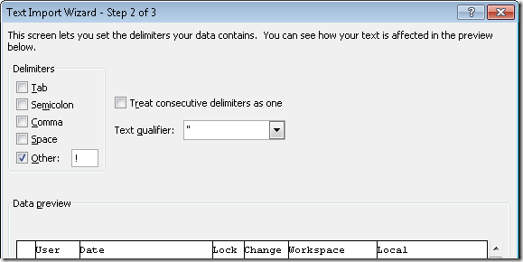
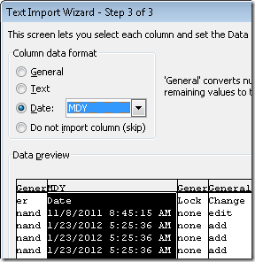
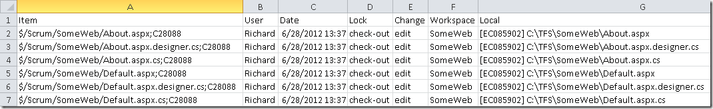

---
title: "Exporting TF Status to Excel"
date: 2012-12-14T10:15:18Z
authors: ["Richard Hundhausen"]
slug: "exporting-tf-status-to-excel"
draft: false
tags: ["TFS", "SQL Server"]
---

---

You can use <a href="http://msdn.microsoft.com/en-us/library/9s5ae285.aspx" target="_blank" rel="noopener">TF.EXE STATUS</a> to display information about pending changes to items in one or more workspaces. I use this prior to migrations to see what users have files checked-out and locked, and they types of pending changes I’m up against. The utility can give you two outputs: Brief and Detailed.
 
Brief looks like this:
 

 
Detailed looks like this:
 

 
As you can see, neither is good for grouping, sorting, searching, etc. The answer was to convert it to Excel (or SQL Server for really large outputs) so I could play with the data a bit, but that fact that the structure of the file was complex (not simply fixed-width or delimited) posed problems. I’m sure Excel experts could figure it out, but I cheated and wrote some code. Here are the steps I followed:
 <ol> <li>Ran TF STATUS for all users and exported to Detailed.txt</li></ol> <blockquote> 
<strong>tf.exe status /collection:http://vsalm:8080/tfs/scrum /user:* /format:Detailed &gt; Detailed.txt</strong>
</blockquote> <ol> <li value="2">Ran a command line utility (provided below) that reads the detailed output and generates a CSV file.</li></ol> <blockquote> 
I chose to name the file .CSV even though the delimiter may not be a comma. For my sample, I used an exclamation point. If you are going to use this utility, then you just need to tweak the path names and delimiter and let it rip. Make sure the delimiter you choose isn’t also being used in the body of the document somewhere.
</blockquote> <ol> <li value="3">Launch <strong>Excel</strong>.  <li>From the Data menu select Get External Data &gt; From Text and select the file you just generated.  <li>Select Delimited and specify the character (i.e. <strong>!</strong>) used to delimit the columns.</li></ol> <blockquote> 

</blockquote> <ol> <li value="6">Format the Date column to be a Date (MDY) type.</li></ol> <blockquote> 

</blockquote> 

 
When the wizard is finished, it will give you a nice spreadsheet from which you can sort, group, filter, pivot, etc. to your heart’s content.
 

 
Files: <a href="TFStatus2CSV.zip" target="_blank" rel="noopener">TFStatus2CSV.zip</a>

