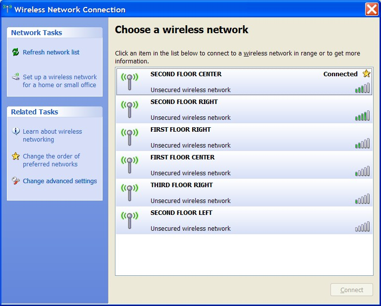

So, I just checked in to this cool, swank hotel in Athens called <a href="http://www.semiramisathens.com/" target="none" rel="noopener">Semiramis</a>. Aside from the bright pink glass doors, see-through bathroom walls, and symbol-coded <a href="http://www.semiramisathens.com/single_double_rooms.asp" target="none" rel="noopener">rooms</a> (no room numbers), they really get the WiFi thing. You know how hotels can be&nbsp;... "yes, we have Internet access." ... "Wired or Wireless?" ... "Wireless" ... "Ok then, please put me in a room that gets a strong signal" ... "sir, it's available in&nbsp;ALL rooms" ... "(sigh)".

Anyway, check out Semiramis' approach ...

Can you tell which part of the hotel my room is in?
