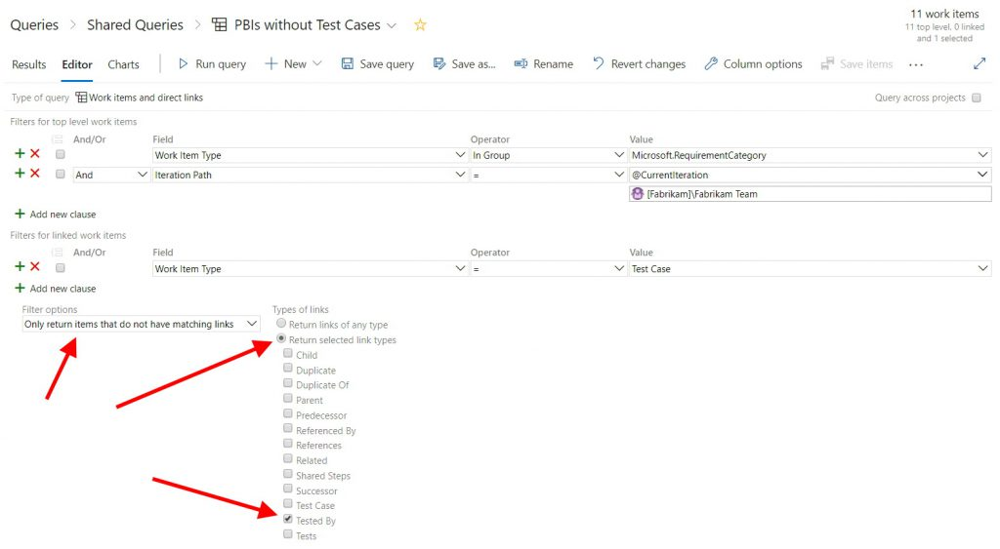

---
title: "Find PBIs Without Test Cases"
date: 2019-10-08T16:33:37Z
author: "Richard Hundhausen"
slug: "find-pbis-without-test-cases"
draft: false
tags: ["Azure Boards", "Azure Test Plans"]
---

---

I'm feeling encouraged. It seems that more and more teams, whether they are using automated or manual tests, are using Azure Test Plans to create and track their acceptance testing efforts. I was teaching a pre-conference workshop at STARWEST last week, and a student asked how to find all the Product Backlog Items (PBIs) in the current Sprint that *didn't* have any associated Test Cases. If a team is using Bug work items, they could be included as well.

I decided to go old school with a solution. I created a work items and direct links query, returning all RequirementCategory (PBI) work items found in the current Sprint, that do not have a matching <em>Tested By</em> link.

