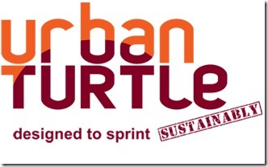

<a href="https://accentient.com" target="_blank" rel="noopener">Accentient</a> is pleased to announce that we are officially a <a href="http://urbanturtle.com/?item=partners" target="_blank" rel="noopener">friend</a> of the <a href="http://urbanturtle.com" target="_blank" rel="noopener">Urban Turtle</a>.
 
Accentient is both an Urban Turtle "Select Partner", which is a highly recognized and trusted organization that can provide you with various services to make you successful with <a href="http://visualstudiogallery.msdn.microsoft.com/en-us/59ac03e3-df99-4776-be39-1917cbfc5d8e" target="_blank" rel="noopener">Scrum TFS</a> and Urban Turtle as well as a <a href="http://www.scrum.org/professionalscrumdeveloper/" target="_blank" rel="noopener">Professional Scrum Developer</a> (PSD) Select Partner who has demonstrated unique value in delivering the PSD course.
 
Urban Turtle is an intuitive Scrum tool for TFS built to simplify your software development cycles. It was built by experienced Scrum coaches and practitioners, Urban Turtle helps you deliver kick-ass software sustainably, every iteration.
 

Check them out!